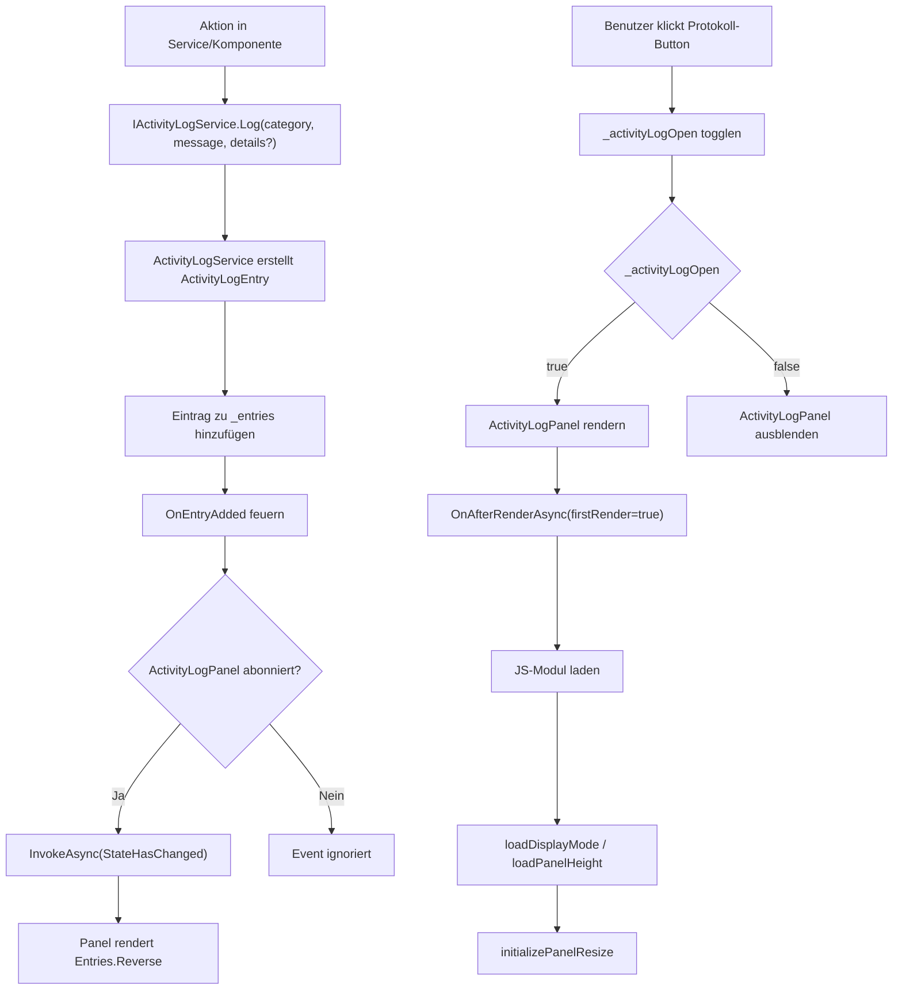

# Aktivitätsprotokoll — Technischer Ablauf

## Übersicht

Der Ablauf gliedert sich in drei Bereiche: die Erzeugung eines Protokolleintrags durch einen Service oder eine Komponente, die Echtzeitaktualisierung des `ActivityLogPanel` per Event, sowie die UI-Steuerung (Panel öffnen, Modus wechseln, Höhe anpassen, leeren).

## Ablauf

### 1. Protokolleintrag erzeugen

Eine aufrufende Komponente oder ein Service ruft `IActivityLogService.Log(category, message, details?)` auf.

Beteiligte Komponenten:
- `IActivityLogService.Log` — öffentliche Methode der Schnittstelle
- `ActivityLogService.Log` — Implementierung: erstellt `ActivityLogEntry` mit `DateTime.Now`, `category`, `message`, `details`; bei Fehler beim Erstellen wird ein `InternalError`-Platzhalter angelegt
- `ActivityLogEntry.Timestamp`, `ActivityLogEntry.Category`, `ActivityLogEntry.Message`, `ActivityLogEntry.Details` — Datensatz des Eintrags
- `ActivityLogService._entries` — interne `List<ActivityLogEntry>`
- `ActivityLogService.OnEntryAdded` — Event wird nach Hinzufügen gefeuert; Fehler im Handler werden still ignoriert

### 2. Panel-Aktualisierung in Echtzeit

`ActivityLogPanel` abonniert `IActivityLogService.OnEntryAdded` in `OnInitialized` und kündigt in `DisposeAsync`.

Beteiligte Komponenten:
- `ActivityLogPanel.OnInitialized` — abonniert `ActivityLogService.OnEntryAdded += OnEntryAdded`
- `ActivityLogPanel.OnEntryAdded` — ruft `InvokeAsync(StateHasChanged)` auf (thread-sicherer Blazor-Update)
- `ActivityLogPanel.DisposeAsync` — kündigt das Event-Abonnement; gibt JS-Modul-Referenz frei (`_jsModule.DisposeAsync()`)
- `ActivityLogPanel` rendert `ActivityLogService.Entries.Reverse()` — neueste Einträge oben

### 3. Protokollierung durch EndpointExecutionService

Beteiligte Komponenten:
- `EndpointExecutionService.ExecuteAsync` — ruft nach dem HTTP-Request `IActivityLogService.Log` auf
- `EndpointExecutionResult.RequestDetails` — enthält `"{Methode} {BaseUrl}{RelativePath}"`
- `EndpointExecutionResult.StatusCode` — HTTP-Statuscode
- `EndpointExecutionResult.ResponseBody` — Response-Body (wird auf max. 10.240 Zeichen gekürzt)
- `EndpointExecutionService.BuildMaskedDetails` — private static Methode; ersetzt Klartextwerte maskierter `EnvironmentVariable`-Instanzen durch `***` im fertigen Detail-String
- `IActiveEnvironmentService.ActiveEnvironment?.Variables` — Quelle der maskierten Variablen

Fallunterscheidungen:
- `response.IsSuccessStatusCode == true`: `Log(EndpointExecuted, "{Methode} {URL} — {Statuscode}", maskedDetails)`
- `!response.IsSuccessStatusCode && result.StatusCode.HasValue`: `Log(HttpError, "{Methode} {URL} — {Statuscode}")`
- Unbehandelte Exception: `Log(InternalError, "{Endpunkt} {Fehlermeldung}", ex.ToString())`

### 4. Protokollierung durch EndpointScriptRunner

Beteiligte Komponenten:
- `EndpointScriptRunner.ExecuteAsync` — vor Ausführung `Log(ScriptExecuted, "Skript ausgeführt: {EndpointName}")`
- `ScriptContext.EndpointName` — optionaler Endpunktname; wird von `EndpointExecutionService.BuildScriptContext` aus `endpoint.Name` befüllt
- `EndpointScriptRunner.RegisterSzObject` — registriert `sz.console.write`-Lambda: ruft `Log(ScriptConsoleOutput, text)` auf
- Bei `JavaScriptException`: `Log(InternalError, "JavaScript-Fehler in Skript: {Name}", ex.ToString())`
- Bei allgemeiner `Exception`: `Log(InternalError, "Skriptausführung fehlgeschlagen: {Name}", ex.ToString())`

### 5. Protokollierung in Home.razor und ApplicationGroupTree.razor

| Methode | Kategorie | Nachricht |
|---------|-----------|-----------|
| `Home.OnGroupSaved` | `EntityCreated` | „Gruppe angelegt." |
| `Home.OnApplicationSaved` | `EntityCreated` | „Anwendung angelegt." |
| `Home.OnGroupRenamed` | `EntityModified` | „Gruppe umbenannt: {Name}" |
| `Home.OnCreateEndpointGroupConfirmed` | `EntityCreated` | „Ordner angelegt: {Name}" |
| `Home.HandleCreateEndpointRequested` | `EntityCreated` | „Endpunkt angelegt: {Name}" |
| `Home.OnEndpointGroupRenamed` | `EntityModified` | „Ordner umbenannt: {Name}" |
| `ApplicationGroupTree.OnDrop` | `EntityMoved` | „Anwendung verschoben: {Name} → {Zielgruppe}" |

### 6. Protokollierung von Kontextwechseln in MainLayout

Beteiligte Komponenten:
- `MainLayout.OnStorageModeChanged` — nach `StorageModeService.SetMode(mode)`: `Log(ContextSwitched, "Modus gewechselt: {mode}")`
- `MainLayout.OnEnvironmentSelectedByUser` — bei benutzerinitiiertem Umgebungswechsel (nicht beim initialen Restore): `Log(ContextSwitched, "Umgebung gewechselt: {Name}")` oder `"Umgebung abgewählt."`

### 7. Panel-Anzeige und Interaktion

Beteiligte Komponenten:
- `MainLayout._activityLogOpen` — bool-Zustand; wird durch `ToggleActivityLog` umgeschaltet
- `MainLayout._activityLogDisplayMode` — `"dock"` oder `"overlay"`; wird aus `localStorage` beim ersten Render geladen
- `MainLayout._activityLogPanelHeight` — Panelhöhe in Pixeln; wird aus `localStorage` beim ersten Render geladen
- `MainLayout` — setzt `style="padding-bottom: {_activityLogPanelHeight}px"` auf `<article>` im Dock-Modus
- `ActivityLogPanel.OnAfterRenderAsync(firstRender)` — lädt JS-Modul; liest `loadDisplayMode()` und `loadPanelHeight()` aus `localStorage`; initialisiert Resize-Handle via `initializePanelResize(handleElement, panelElement)`
- `ActivityLogPanel.ToggleDisplayMode` — schaltet Modus um, speichert via `saveDisplayMode(mode)`; löst `OnDisplayModeChanged`-Event aus
- `ActivityLogPanel.ClearLog` — ruft `ActivityLogService.Clear()` auf und löst `StateHasChanged` aus
- `activity-log-panel.js` — stellt `initializePanelResize`, `saveDisplayMode`, `loadDisplayMode`, `savePanelHeight`, `loadPanelHeight` bereit
- `LocalStorageKeys.ActivityLogDisplayMode` → `"activityLogDisplayMode"`
- `LocalStorageKeys.ActivityLogPanelHeight` → `"activityLogPanelHeight"`

## Diagramm

## Fehlerbehandlung

- `ActivityLogService.Log`: Fehler beim Erstellen des `ActivityLogEntry` werden per `catch` abgefangen; stattdessen wird ein `InternalError`-Platzhalter angelegt. Fehler im `OnEntryAdded`-Handler werden still ignoriert.
- `ActivityLogPanel.DisposeAsync`: `JSDisconnectedException` beim Freigeben des JS-Moduls wird ignoriert (tritt auf, wenn die Verbindung bereits getrennt ist).
- `MainLayout.OnAfterRenderAsync`: `localStorage`-Zugriff ist in einem try/catch eingebettet; Fehler beim Server-Prerendering werden ignoriert.
