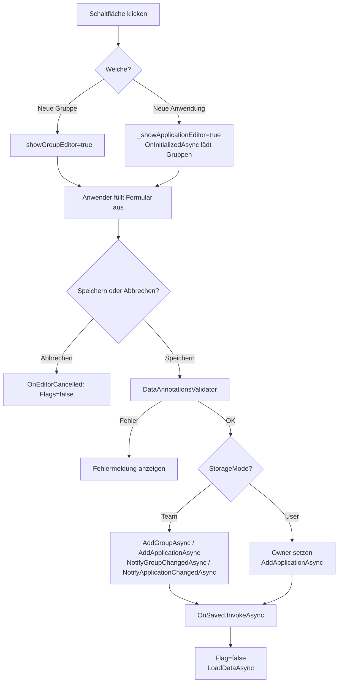
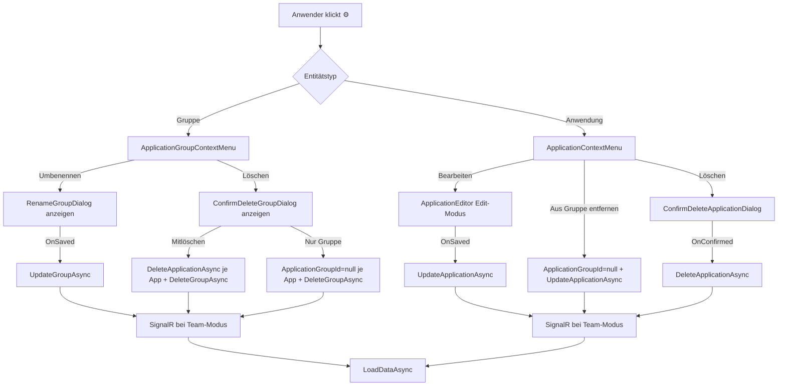

# Anwendungen — Technischer Ablauf

## Übersicht

Alle Operationen im Navigationsbaum werden von `ApplicationGroupTree` orchestriert. Die Komponente hält private Zustandsfelder für offene Dialoge und die aktuell bearbeiteten Entitäten. Nach jeder persistierenden Operation wird `LoadDataAsync` aufgerufen, um den Baum zu aktualisieren.

---

## Ablauf: Neue Gruppe oder Anwendung anlegen

### 1. Formular einblenden

Der Anwender klickt auf „Neue Gruppe" oder „Neue Anwendung".

- `ApplicationGroupTree.ShowGroupEditor` — setzt `_showGroupEditor = true`, `_showApplicationEditor = false`
- `ApplicationGroupTree.ShowApplicationEditor` — setzt `_showApplicationEditor = true`, `_showGroupEditor = false`

### 2. Initialisierung des `ApplicationEditor`

`ApplicationEditor.OnInitializedAsync` erkennt, ob `ExistingApplication == null` (Anlage-Modus). Es ruft `IApplicationRepository.GetGroupsAsync` auf und befüllt `_groups` für das Gruppen-Dropdown.

### 3. Formulareingabe und Validierung

Das `EditForm` führt eine `DataAnnotationsValidator`-Prüfung durch. Bei Fehlern wird die Meldung neben dem Feld angezeigt; `SaveAsync` wird nur bei erfolgreicher Validierung aufgerufen.

### 4. Persistierung — Gruppe anlegen

- `ApplicationGroupEditor.SaveAsync` — ruft `IApplicationRepository.AddGroupAsync(_model)` auf.
- Bei `StorageMode.Team`: `ISignalRNotificationService.NotifyGroupChangedAsync(saved.Id)`.
- Nach Erfolg: `OnSaved.InvokeAsync()` → `ApplicationGroupTree.OnGroupSaved` setzt Flag auf `false` und ruft `LoadDataAsync()` auf.
- Bei Exception: `_errorMessage` wird gesetzt.

### 5. Persistierung — Anwendung anlegen

- `ApplicationEditor.SaveAsync` — bei `StorageMode.User` wird `_model.Owner` auf `ICurrentUserService.GetCurrentUserName()` gesetzt.
- Ruft `IApplicationRepository.AddApplicationAsync(_model)` auf.
- Bei `StorageMode.Team`: `ISignalRNotificationService.NotifyApplicationChangedAsync(saved.Id)`.
- Nach Erfolg: `OnSaved.InvokeAsync()` → `ApplicationGroupTree.OnApplicationSaved` setzt Flag auf `false` und ruft `LoadDataAsync()` auf.

### 6. Abbrechen

`ApplicationGroupEditor.Cancel` / `ApplicationEditor.Cancel` ruft `OnCancel.InvokeAsync()` auf. `ApplicationGroupTree.OnEditorCancelled` setzt beide Sichtbarkeits-Flags auf `false`.

---

## Ablauf: Kontextmenü öffnen und Aktion auslösen

1. CSS-Regeln halten `.context-menu-toggle` (der Zahnrad-Button) mit `opacity: 0` standardmäßig unsichtbar.
2. Der Anwender fährt mit der Maus auf eine `.tree-leaf`-Zeile oder setzt Tastaturfokus auf den Toggle-Button — `:hover` bzw. `:focus-within` auf dem Eltern-Container setzen `opacity: 1`.
3. Klick auf den Toggle-Button → `ToggleMenu` setzt `_isOpen = !_isOpen`; gleichzeitig erhält der `.context-menu-container` die CSS-Klasse `menu-open` (via `@(_isOpen ? "menu-open" : "")`), die den Selektor `.context-menu-container.menu-open .context-menu-toggle { opacity: 1 }` aktiviert und das Icon sichtbar hält.
4. Das `.context-menu-dropdown`-Panel erscheint via `@if (_isOpen)` — positioniert als `position: absolute; top: 100%; right: 0` relativ zum `.context-menu-container` (`position: relative`); `z-index: 1000` liegt über dem Overlay-Div mit `z-index: 999`.
5. Klick auf einen Menü-Eintrag → der `@onclick`-Handler des Dropdown-Buttons wird ausgelöst (das Dropdown liegt z-Index-technisch über dem Overlay), setzt `_isOpen = false` und ruft den entsprechenden `EventCallback` auf.
6. Klick außerhalb des Dropdowns trifft das transparente `.context-menu-overlay` (position: fixed; inset: 0) → setzt `_isOpen = false`.

Beteiligte Komponenten: `ApplicationContextMenu`, `ApplicationGroupContextMenu`, `app.css`

---

## Ablauf: Gruppe umbenennen

1. Anwender klickt ⚙ → `ApplicationGroupContextMenu.ToggleMenu` öffnet Dropdown.
2. Klick auf „Umbenennen" → `OnRenameRequested` mit `ApplicationGroup`-Instanz.
3. `ApplicationGroupTree.OnRenameGroupRequested(group)` setzt `_renameTargetGroup = group` → `RenameGroupDialog` wird gerendert.
4. `RenameGroupDialog.SaveAsync` löst `OnSaved` aus → `ApplicationGroupTree.OnGroupRenamed(group)`:
   - `ApplicationRepository.UpdateGroupAsync(group)`
   - Bei `StorageMode.Team`: `SignalRNotificationService.NotifyGroupChangedAsync(group.Id)`
   - `LoadDataAsync()`
5. Bei `DbUpdateConcurrencyException` oder sonstiger Exception: `_errorMessage` wird gesetzt.

---

## Ablauf: Gruppe löschen

1. `ApplicationGroupTree.OnDeleteGroupRequested(group)` setzt `_deleteTargetGroup = group` → `ConfirmDeleteGroupDialog` wird mit `Applications.Count` gerendert.

**Option „Mitlöschen"** → `ApplicationGroupTree.OnDeleteGroupConfirmedAll(group)`:
1. `ProcessGroupApplicationsAsync`: Für jede Anwendung der Gruppe: `DeleteApplicationAsync` + ggf. `NotifyApplicationChangedAsync`
2. `DeleteGroupAsync(group.Id)` + ggf. `NotifyGroupChangedAsync`
3. `LoadDataAsync()`

**Option „Nur Gruppe löschen"** → `ApplicationGroupTree.OnDeleteGroupConfirmedGroupOnly(group)`:
1. `ProcessGroupApplicationsAsync`: Für jede Anwendung: `app.ApplicationGroupId = null`, `UpdateApplicationAsync` + ggf. `NotifyApplicationChangedAsync`
2. `DeleteGroupAsync(group.Id)` + ggf. `NotifyGroupChangedAsync`
3. `LoadDataAsync()`

---

## Ablauf: Anwendung bearbeiten

1. `ApplicationContextMenu.EditRequested` → `ApplicationGroupTree.OnEditApplicationRequested(application)` setzt `_editTargetApplication = application` → `ApplicationEditor` mit `ExistingApplication="_editTargetApplication"` wird gerendert.
2. `ApplicationEditor.OnInitializedAsync` erkennt `ExistingApplication != null`, setzt `_isEditMode = true`, kopiert den Datensatz via `ExistingApplication.Clone()` in `_model`.
3. `ApplicationEditor.SaveAsync`:
   - Im Benutzermodus: `_model.Owner = CurrentUserService.GetCurrentUserName()`
   - `ApplicationRepository.UpdateApplicationAsync(_model)`
   - Bei `StorageMode.Team`: `SignalRNotificationService.NotifyApplicationChangedAsync(saved.Id)`
   - `OnSaved.InvokeAsync()` → `ApplicationGroupTree.OnApplicationEdited()` setzt `_editTargetApplication = null` und ruft `LoadDataAsync()` auf.
4. Bei `DbUpdateConcurrencyException`: `_errorMessage` wird inline im Formular angezeigt; der Dialog bleibt geöffnet.

---

## Ablauf: Aus Gruppe entfernen

`ApplicationGroupTree.OnRemoveFromGroupRequested(application)`:
1. Sichert `previousGroupId = application.ApplicationGroupId`
2. Setzt `application.ApplicationGroupId = null`
3. `ApplicationRepository.UpdateApplicationAsync(application)`
4. Bei Fehler: stellt `application.ApplicationGroupId = previousGroupId` wieder her
5. Bei `StorageMode.Team`: `SignalRNotificationService.NotifyApplicationChangedAsync(application.Id)`
6. `LoadDataAsync()`

---

## Ablauf: Anwendung löschen

`ApplicationGroupTree.OnDeleteApplicationRequested(application)` setzt `_deleteTargetApplication = application`. Nach Bestätigung ruft `ApplicationGroupTree.OnDeleteApplicationConfirmed(application)`:
1. `ApplicationRepository.DeleteApplicationAsync(application.Id)`
2. Bei `StorageMode.Team`: `SignalRNotificationService.NotifyApplicationChangedAsync(application.Id)`
3. `OnSelectionCleared.InvokeAsync()` — blendet `ApplicationCard` in `Home` aus
4. `LoadDataAsync()`

---

## Ablauf: Drag & Drop

1. `ApplicationGroupTree.OnDragStart(application)` speichert die gezogene Anwendung in `_draggedApplication`.
2. Der Benutzer zieht das Element über einen Gruppen-Wrapper-`
` — `@ondragenter` ruft `OnDragEnter(group.Id)` auf:
   - Wenn die Gruppe neu ist (`_dropTargetGroupId != group.Id`): `_dropTargetGroupId = group.Id`, `_dragEnterCount = 1`.
   - Wenn bereits dieselbe Gruppe aktiv ist: `_dragEnterCount++`.
   - Die CSS-Klasse `drag-over` (gestrichelter blauer Rahmen) wird conditional auf dem Wrapper-`
` gerendert.
3. Verlässt der Cursor den Gruppen-Wrapper — `@ondragleave` ruft `OnDragLeave()` auf:
   - `_dragEnterCount--`; wenn `<= 0`: `_dropTargetGroupId = null`. Der Counter verhindert falsches Entfernen der `drag-over`-Klasse, wenn der Cursor über Kind-Elemente wandert.
4. Für den Bereich „Ohne Gruppe" gelten die analogen Handler `OnDragEnterUngrouped` / `OnDragLeaveUngrouped` mit eigenem Zähler `_dragEnterCountUngrouped` und Flag `_dropTargetIsUngrouped`.
5. `CollapsibleSection` leitet `ondrop` über `HandleDrop` an `ApplicationGroupTree.OnDrop(targetGroupId)` weiter; `@ondragover:preventDefault` auf dem `collapsible-section`-Container erlaubt den Drop im Browser.
6. `OnDrop`:
   - Sichert `previousGroupId`
   - Setzt `_draggedApplication.ApplicationGroupId = targetGroupId`
   - `ApplicationRepository.UpdateApplicationAsync(_draggedApplication)`
   - Bei Fehler: stellt `previousGroupId` wieder her
   - Bei `StorageMode.Team`: `SignalRNotificationService.NotifyApplicationChangedAsync(...)`
   - Setzt `_draggedApplication`, `_dropTargetGroupId`, `_dropTargetIsUngrouped` und beide Counter zurück
   - `LoadDataAsync()`

---

## Ablauf: Moduswechsel

`StorageModeService` löst `OnModeChanged` aus. `ApplicationGroupTree` ist via `IDisposable` abonniert.

`ApplicationGroupTree.OnModeChanged` (läuft via `InvokeAsync` auf dem Blazor-Synchronisierungskontext):
1. Alle Zustandsfelder zurücksetzen: `_renameTargetGroup`, `_deleteTargetGroup`, `_deleteTargetApplication`, `_editTargetApplication`, `_draggedApplication` → `null`; `_showGroupEditor`, `_showApplicationEditor` → `false`
2. `LoadDataAsync()` — lädt Daten des neuen Modus
3. `OnSelectionCleared.InvokeAsync()` — `Home.OnSelectionCleared()` setzt `_selectedApplicationId = null`
4. `StateHasChanged()`

---

## Gesamtdiagramm (Bearbeiten und Verwalten)

---

## Fehlerbehandlung

Beide Editoren und alle Handler in `ApplicationGroupTree` fangen Ausnahmen ab und setzen `_errorMessage`. Die Fehlermeldung wird als `alert alert-danger` angezeigt. Formulare bleiben bei Fehlern geöffnet.
