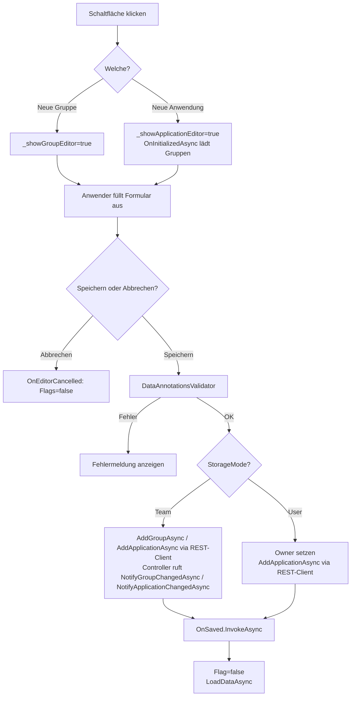
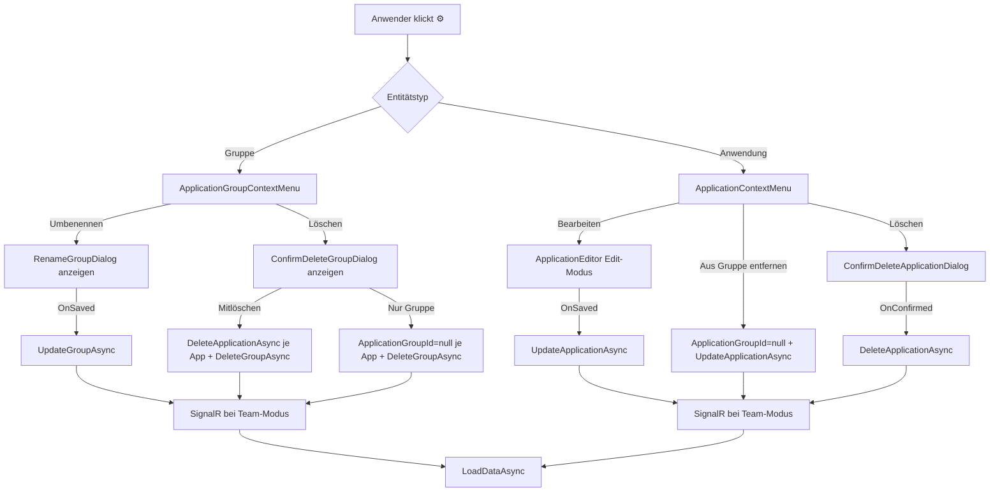
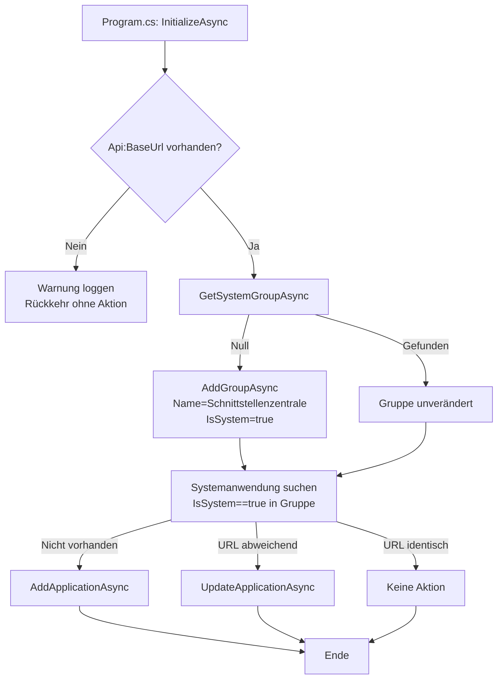
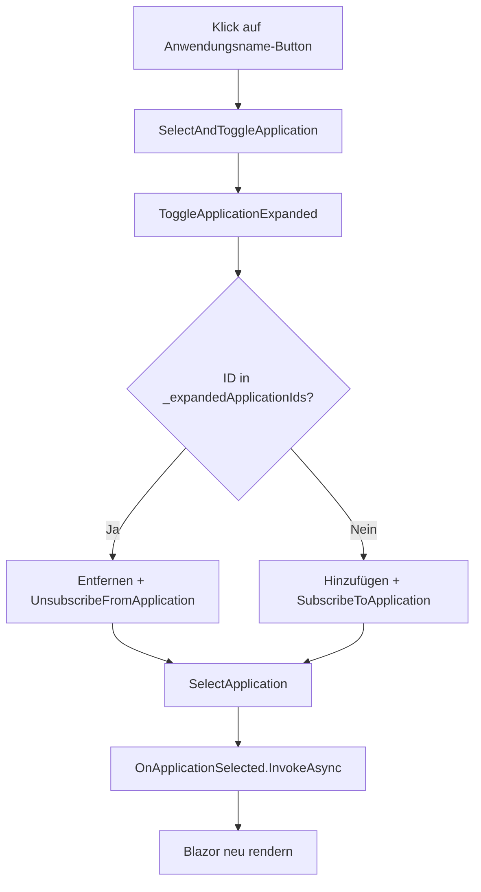

# Anwendungen — Technischer Ablauf

## Übersicht

Alle Operationen im Navigationsbaum werden von `ApplicationGroupTree` orchestriert. Die Komponente hält private Zustandsfelder für offene Dialoge und die aktuell bearbeiteten Entitäten. Nach jeder persistierenden Operation wird `LoadDataAsync` aufgerufen, um den Baum zu aktualisieren.

---

## Ablauf: Neue Gruppe oder Anwendung anlegen

### 1. Formular einblenden

Der Anwender klickt auf „Neue Gruppe" oder „Neue Anwendung".

- `ApplicationGroupTree.ShowGroupEditor` — setzt `_showGroupEditor = true`, `_showApplicationEditor = false`
- `ApplicationGroupTree.ShowApplicationEditor` — setzt `_showApplicationEditor = true`, `_showGroupEditor = false`

### 2. Initialisierung des `ApplicationEditor`

`ApplicationEditor.OnInitializedAsync` erkennt, ob `ExistingApplication == null` (Anlage-Modus). Es ruft `IApplicationRepository.GetGroupsAsync` auf und befüllt `_groups` für das Gruppen-Dropdown.

### 3. Formulareingabe und Validierung

Das `EditForm` führt eine `DataAnnotationsValidator`-Prüfung durch. Bei Fehlern wird die Meldung neben dem Feld angezeigt; `SaveAsync` wird nur bei erfolgreicher Validierung aufgerufen.

### 4. Persistierung — Gruppe anlegen

- `ApplicationGroupEditor.SaveAsync` — ruft `IApplicationApiClient.AddGroupAsync(new CreateApplicationGroupRequest { Name = ... }, storageMode)` auf.
- `ApplicationApiClient` authentifiziert sich bei Bedarf über `POST /authenticate` und sendet den Request an `POST /api/application-groups` mit Bearer-Token und `X-Storage-Mode`-Header.
- Im Controller: `IApplicationRepository.AddGroupAsync`, bei `StorageMode.Team` anschließend `ISignalRNotificationService.NotifyGroupChangedAsync(saved.Id)`.
- Nach Erfolg: `OnSaved.InvokeAsync()` → `ApplicationGroupTree.OnGroupSaved` setzt Flag auf `false` und ruft `LoadDataAsync()` auf.
- Bei Exception: `_errorMessage` wird gesetzt.

### 5. Persistierung — Anwendung anlegen

- `ApplicationEditor.SaveAsync` — bei `StorageMode.User` wird `_model.Owner` auf `ICurrentUserService.GetCurrentUserName()` gesetzt.
- Ruft `IApplicationApiClient.AddApplicationAsync(new CreateApplicationRequest { ... }, storageMode)` auf.
- `ApplicationApiClient` sendet den Request an `POST /api/applications`; im Controller: `IApplicationRepository.AddApplicationAsync`, `InterfaceType` wird via `Application.DetectInterfaceType(request.InterfaceUrl)` abgeleitet; bei `StorageMode.Team` anschließend `ISignalRNotificationService.NotifyApplicationChangedAsync(saved.Id)`.
- Nach Erfolg: `OnSaved.InvokeAsync()` → `ApplicationGroupTree.OnApplicationSaved` setzt Flag auf `false` und ruft `LoadDataAsync()` auf.

### 6. Abbrechen

`ApplicationGroupEditor.Cancel` / `ApplicationEditor.Cancel` ruft `OnCancel.InvokeAsync()` auf. `ApplicationGroupTree.OnEditorCancelled` setzt beide Sichtbarkeits-Flags auf `false`.

---

## Ablauf: Kontextmenü öffnen und Aktion auslösen

1. CSS-Regeln halten `.context-menu-toggle` (der Zahnrad-Button) mit `opacity: 0` standardmäßig unsichtbar.
2. Der Anwender fährt mit der Maus auf eine `.tree-leaf`-Zeile oder setzt Tastaturfokus auf den Toggle-Button — `:hover` bzw. `:focus-within` auf dem Eltern-Container setzen `opacity: 1`.
3. Klick auf den Toggle-Button → `ToggleMenu` setzt `_isOpen = !_isOpen`; gleichzeitig erhält der `.context-menu-container` die CSS-Klasse `menu-open` (via `@(_isOpen ? "menu-open" : "")`), die den Selektor `.context-menu-container.menu-open .context-menu-toggle { opacity: 1 }` aktiviert und das Icon sichtbar hält.
4. Das `.context-menu-dropdown`-Panel erscheint via `@if (_isOpen)` — positioniert als `position: absolute; top: 100%; right: 0` relativ zum `.context-menu-container` (`position: relative`); `z-index: 1000` liegt über dem Overlay-Div mit `z-index: 999`.
5. Klick auf einen Menü-Eintrag → der `@onclick`-Handler des Dropdown-Buttons wird ausgelöst (das Dropdown liegt z-Index-technisch über dem Overlay), setzt `_isOpen = false` und ruft den entsprechenden `EventCallback` auf.
6. Klick außerhalb des Dropdowns trifft das transparente `.context-menu-overlay` (position: fixed; inset: 0) → setzt `_isOpen = false`.

Beteiligte Komponenten: `ApplicationContextMenu`, `ApplicationGroupContextMenu`, `app.css`

---

## Ablauf: Gruppe umbenennen

1. Anwender klickt ⚙ → `ApplicationGroupContextMenu.ToggleMenu` öffnet Dropdown.
2. Klick auf „Umbenennen" → `OnRenameRequested` mit `ApplicationGroup`-Instanz.
3. `ApplicationGroupTree.OnRenameGroupRequested(group)` setzt `_renameTargetGroup = group` → `RenameGroupDialog` wird gerendert.
4. `RenameGroupDialog.SaveAsync` löst `OnSaved` aus → `ApplicationGroupTree.OnGroupRenamed(group)`:
   - `ApplicationRepository.UpdateGroupAsync(group)`
   - Bei `StorageMode.Team`: `SignalRNotificationService.NotifyGroupChangedAsync(group.Id)`
   - `LoadDataAsync()`
5. Bei `DbUpdateConcurrencyException` oder sonstiger Exception: `_errorMessage` wird gesetzt.

---

## Ablauf: Gruppe löschen

1. `ApplicationGroupTree.OnDeleteGroupRequested(group)` setzt `_deleteTargetGroup = group` → `ConfirmDeleteGroupDialog` wird mit `Applications.Count` gerendert.

**Option „Mitlöschen"** → `ApplicationGroupTree.OnDeleteGroupConfirmedAll(group)`:
1. `ProcessGroupApplicationsAsync`: Für jede Anwendung der Gruppe: `DeleteApplicationAsync` + ggf. `NotifyApplicationChangedAsync`
2. `DeleteGroupAsync(group.Id)` + ggf. `NotifyGroupChangedAsync`
3. `LoadDataAsync()`

**Option „Nur Gruppe löschen"** → `ApplicationGroupTree.OnDeleteGroupConfirmedGroupOnly(group)`:
1. `ProcessGroupApplicationsAsync`: Für jede Anwendung: `app.ApplicationGroupId = null`, `UpdateApplicationAsync` + ggf. `NotifyApplicationChangedAsync`
2. `DeleteGroupAsync(group.Id)` + ggf. `NotifyGroupChangedAsync`
3. `LoadDataAsync()`

---

## Ablauf: Anwendung bearbeiten

1. `ApplicationContextMenu.EditRequested` → `ApplicationGroupTree.OnEditApplicationRequested(application)` setzt `_editTargetApplication = application` → `ApplicationEditor` mit `ExistingApplication="_editTargetApplication"` wird gerendert.
2. `ApplicationEditor.OnInitializedAsync` erkennt `ExistingApplication != null`, setzt `_isEditMode = true`, kopiert den Datensatz via `ExistingApplication.Clone()` in `_model`.
3. `ApplicationEditor.SaveAsync`:
   - Im Benutzermodus: `_model.Owner = CurrentUserService.GetCurrentUserName()`
   - `ApplicationRepository.UpdateApplicationAsync(_model)`
   - Bei `StorageMode.Team`: `SignalRNotificationService.NotifyApplicationChangedAsync(saved.Id)`
   - `OnSaved.InvokeAsync()` → `ApplicationGroupTree.OnApplicationEdited()` setzt `_editTargetApplication = null` und ruft `LoadDataAsync()` auf.
4. Bei `DbUpdateConcurrencyException`: `_errorMessage` wird inline im Formular angezeigt; der Dialog bleibt geöffnet.

---

## Ablauf: Aus Gruppe entfernen

`ApplicationGroupTree.OnRemoveFromGroupRequested(application)`:
1. Sichert `previousGroupId = application.ApplicationGroupId`
2. Setzt `application.ApplicationGroupId = null`
3. `ApplicationRepository.UpdateApplicationAsync(application)`
4. Bei Fehler: stellt `application.ApplicationGroupId = previousGroupId` wieder her
5. Bei `StorageMode.Team`: `SignalRNotificationService.NotifyApplicationChangedAsync(application.Id)`
6. `LoadDataAsync()`

---

## Ablauf: Anwendung löschen

`ApplicationGroupTree.OnDeleteApplicationRequested(application)` setzt `_deleteTargetApplication = application`. Nach Bestätigung ruft `ApplicationGroupTree.OnDeleteApplicationConfirmed(application)`:
1. `ApplicationRepository.DeleteApplicationAsync(application.Id)`
2. Bei `StorageMode.Team`: `SignalRNotificationService.NotifyApplicationChangedAsync(application.Id)`
3. `OnSelectionCleared.InvokeAsync()` — blendet `ApplicationContentView` in `Home` aus
4. `LoadDataAsync()`

---

## Ablauf: Drag & Drop

1. `ApplicationGroupTree.OnDragStart(application)` speichert die gezogene Anwendung in `_draggedApplication`.
2. Der Benutzer zieht das Element über einen Gruppen-Wrapper-`
` — `@ondragenter` ruft `OnDragEnter(group.Id)` auf:
   - Wenn die Gruppe neu ist (`_dropTargetGroupId != group.Id`): `_dropTargetGroupId = group.Id`, `_dragEnterCount = 1`.
   - Wenn bereits dieselbe Gruppe aktiv ist: `_dragEnterCount++`.
   - Die CSS-Klasse `drag-over` (gestrichelter blauer Rahmen) wird conditional auf dem Wrapper-`
` gerendert.
3. Verlässt der Cursor den Gruppen-Wrapper — `@ondragleave` ruft `OnDragLeave()` auf:
   - `_dragEnterCount--`; wenn `<= 0`: `_dropTargetGroupId = null`. Der Counter verhindert falsches Entfernen der `drag-over`-Klasse, wenn der Cursor über Kind-Elemente wandert.
4. Für den Bereich „Ohne Gruppe" gelten die analogen Handler `OnDragEnterUngrouped` / `OnDragLeaveUngrouped` mit eigenem Zähler `_dragEnterCountUngrouped` und Flag `_dropTargetIsUngrouped`.
5. `CollapsibleSection` leitet `ondrop` über `HandleDrop` an `ApplicationGroupTree.OnDrop(targetGroupId)` weiter; `@ondragover:preventDefault` auf dem `collapsible-section`-Container erlaubt den Drop im Browser.
6. `OnDrop`:
   - Sichert `previousGroupId`
   - Setzt `_draggedApplication.ApplicationGroupId = targetGroupId`
   - `ApplicationRepository.UpdateApplicationAsync(_draggedApplication)`
   - Bei Fehler: stellt `previousGroupId` wieder her
   - Bei `StorageMode.Team`: `SignalRNotificationService.NotifyApplicationChangedAsync(...)`
   - Setzt `_draggedApplication`, `_dropTargetGroupId`, `_dropTargetIsUngrouped` und beide Counter zurück
   - `LoadDataAsync()`

---

## Ablauf: Moduswechsel

`StorageModeService` löst `OnModeChanged` aus. `ApplicationGroupTree` ist via `IDisposable` abonniert.

`ApplicationGroupTree.OnModeChanged` (läuft via `InvokeAsync` auf dem Blazor-Synchronisierungskontext):
1. Alle Zustandsfelder zurücksetzen: `_renameTargetGroup`, `_deleteTargetGroup`, `_deleteTargetApplication`, `_editTargetApplication`, `_draggedApplication` → `null`; `_showGroupEditor`, `_showApplicationEditor` → `false`
2. `LoadDataAsync()` — lädt Daten des neuen Modus
3. `OnSelectionCleared.InvokeAsync()` — `Home.OnSelectionCleared()` setzt `_selectedApplicationId = null`
4. `StateHasChanged()`

---

## Gesamtdiagramm (Bearbeiten und Verwalten)

---

## Ablauf: Systemeinträge beim Programmstart anlegen oder aktualisieren

Dieser Ablauf wird in `Program.cs` nach `EnsureDatabaseInitializedAsync` ausgeführt.

### 1. `SystemEntryInitializer.InitializeAsync` aufrufen

`Program.cs` ruft `SystemEntryInitializer.InitializeAsync(app.Services, builder.Configuration)` auf. Die Methode erstellt einen `IServiceScope` und löst `IApplicationRepository` auf.

### 2. `Api:BaseUrl` prüfen

Der Wert `Api:BaseUrl` wird aus `IConfiguration` gelesen. Ist er leer oder nicht vorhanden, loggt `Serilog` eine Warnung und die Methode kehrt ohne Aktion zurück.

### 3. Systemgruppe laden oder anlegen

`IApplicationRepository.GetSystemGroupAsync` fragt die Datenbank nach einer `ApplicationGroup` mit `IsSystem == true`.

- **Nicht vorhanden:** `IApplicationRepository.AddGroupAsync` legt eine neue Gruppe mit `Name = "Schnittstellenzentrale"` und `IsSystem = true` an.
- **Vorhanden:** keine Änderung an der Gruppe.

### 4. Systemanwendung laden oder anlegen oder aktualisieren

Innerhalb der Gruppe wird nach einer `Application` mit `IsSystem == true` gesucht.

- **Nicht vorhanden:** `IApplicationRepository.AddApplicationAsync` legt eine neue Anwendung an (`Name = "Schnittstellenzentrale"`, `IsSystem = true`, `BaseUrl = {Api:BaseUrl}`, `InterfaceUrl = {Api:BaseUrl}/swagger/v1/swagger.json`).
- **Vorhanden, URL weicht ab:** `IApplicationRepository.UpdateApplicationAsync` aktualisiert `BaseUrl` und `InterfaceUrl`.
- **Vorhanden, URL identisch:** keine Aktion.

Jede Ausnahme in den Schritten 2–4 wird abgefangen, per Serilog als Fehler geloggt und verschluckt — der Programmstart wird nicht unterbrochen.

Beteiligte Klassen/Komponenten: `SystemEntryInitializer`, `Program`, `IApplicationRepository`, `ApplicationRepository`, `ApplicationGroup`, `Application`

---

## Ablauf: DELETE / PUT auf Systemeintrag abweisen (REST-API)

Wenn ein API-Client versucht, eine Systemgruppe oder -anwendung zu löschen oder zu ändern, greifen Guards in den Controllern.

### Gruppe löschen oder umbenennen (`ApplicationGroupsController`)

1. `GetGroupByIdAsync` lädt die Gruppe; ist sie nicht gefunden, wird `404 Not Found` zurückgegeben.
2. Ist `group.IsSystem == true`, gibt `DeleteAsync` bzw. `UpdateAsync` sofort `403 Forbidden` zurück.
3. Andernfalls wird die Operation durchgeführt.

### Anwendung löschen oder bearbeiten (`ApplicationsController`)

1. `GetApplicationByIdAsync` lädt die Anwendung; ist sie nicht gefunden, wird `404 Not Found` zurückgegeben.
2. Ist `application.IsSystem == true`, gibt `DeleteAsync` bzw. `UpdateAsync` sofort `403 Forbidden` zurück.
3. Andernfalls wird die Operation durchgeführt.

Beteiligte Klassen/Komponenten: `ApplicationGroupsController`, `ApplicationsController`, `IApplicationRepository`

---

## Ablauf: Drag & Drop für Systemanwendungen sperren

1. `ApplicationGroupTree.OnDragStart(application)` wird aufgerufen.
2. Ist `application.IsSystem == true`, kehrt die Methode sofort zurück ohne `_draggedApplication` zu setzen.
3. Ergänzend ist im Razor-Template `draggable="@(app.IsSystem ? "false" : "true")"` gesetzt, sodass der Browser das Ziehen gar nicht erst ermöglicht.
4. `OnDrop` prüft `_draggedApplication == null` und bricht ohne Aktion ab, falls kein gültiges Drag-Objekt existiert.

Beteiligte Klassen/Komponenten: `ApplicationGroupTree`

---

## Fehlerbehandlung

Beide Editoren und alle Handler in `ApplicationGroupTree` fangen Ausnahmen ab und setzen `_errorMessage`. Die Fehlermeldung wird als `alert alert-danger` angezeigt. Formulare bleiben bei Fehlern geöffnet.

`SystemEntryInitializer` fängt alle Ausnahmen im `try/catch`-Block ab und loggt sie per Serilog — der Programmstart wird dadurch nicht unterbrochen.

---

## Ablauf: Navigationsbaum mit Endpunkten und Ordnern laden (Eager Loading)

`ApplicationGroupTree.LoadDataAsync` lädt beim Initialisieren (und bei jedem `RefreshAsync`-Aufruf) alle Endpunktgruppen und Endpunkte für jede Anwendung:

1. `IApplicationApiClient.GetGroupsAsync` und `GetUngroupedApplicationsAsync` liefern die Anwendungsstruktur.
2. Für jede `Application` wird `ReloadApplicationDataAsync(applicationId)` aufgerufen:
   - `IEndpointRepository.GetEndpointGroupsAsync(applicationId)` → wird in `_endpointGroups[applicationId]` gespeichert.
   - `IEndpointRepository.GetEndpointsAsync(applicationId)` → wird in `_endpoints[applicationId]` gespeichert.
3. SignalR-Events `EndpointChanged(endpointId, applicationId)` und `EndpointGroupChanged(groupId, applicationId)` lösen ebenfalls `ReloadApplicationDataAsync(applicationId)` aus.

Beim Aufklappen eines Anwendungsknotens (`ToggleApplicationExpanded`) wird die `applicationId` zu `_expandedApplicationIds` hinzugefügt und `EndpointHub.SubscribeToApplication(applicationId)` aufgerufen; beim Zuklappen wird abonniert und aus `_expandedApplicationIds` entfernt.

`DisposeAsync` kündigt alle verbleibenden SignalR-Abonnements und gibt JS-Ressourcen frei.

Beteiligte Klassen/Komponenten: `ApplicationGroupTree`, `IEndpointRepository`, `IApplicationApiClient`, `HubConnection`

---

## Ablauf: Ordner (`EndpointGroup`) anlegen

1. Anwender klickt im `ApplicationContextMenu` auf „Ordner anlegen".
2. `ApplicationContextMenu.CreateEndpointGroupRequested` ruft `OnCreateEndpointGroupRequested.InvokeAsync(Application)` auf.
3. `Home.HandleCreateEndpointGroupRequested(application)`:
   - Legt `EndpointGroup { Name = "Neuer Ordner", ApplicationId = application.Id }` an.
   - `IEndpointRepository.AddEndpointGroupAsync(group)` speichert die Gruppe.
   - Bei `StorageMode.Team`: `ISignalRNotificationService.NotifyEndpointGroupChangedAsync(saved.Id, application.Id)`.
   - `_tree.RefreshAsync()` lädt den Baum neu.

Beteiligte Klassen/Komponenten: `ApplicationContextMenu`, `Home`, `IEndpointRepository`, `ISignalRNotificationService`, `ApplicationGroupTree`

---

## Ablauf: Ordner (`EndpointGroup`) umbenennen

1. Anwender klickt im `EndpointGroupContextMenu` auf „Ordner umbenennen".
2. `EndpointGroupContextMenu.RenameRequested` ruft `OnRenameEndpointGroupRequested.InvokeAsync(Group)` auf.
3. `Home.HandleRenameEndpointGroupRequested(group)` setzt `_renameTargetEndpointGroup = group` → `RenameEndpointGroupDialog` wird gerendert.
4. `RenameEndpointGroupDialog.SaveAsync` löst `OnSaved.InvokeAsync(_model)` aus → `Home.OnEndpointGroupRenamed(group)`:
   - `IEndpointRepository.UpdateEndpointGroupAsync(group)`.
   - Bei `StorageMode.Team`: `ISignalRNotificationService.NotifyEndpointGroupChangedAsync(group.Id, group.ApplicationId)`.
   - `_tree.RefreshAsync()`.

Beteiligte Klassen/Komponenten: `EndpointGroupContextMenu`, `RenameEndpointGroupDialog`, `Home`, `IEndpointRepository`, `ISignalRNotificationService`, `ApplicationGroupTree`

---

## Ablauf: Ordner (`EndpointGroup`) löschen

1. Anwender klickt im `EndpointGroupContextMenu` auf „Ordner löschen".
2. `Home.HandleDeleteEndpointGroupRequested(group)`:
   - Lädt alle Endpunkte der Anwendung via `IEndpointRepository.GetEndpointsAsync(group.ApplicationId)`.
   - Zählt die Endpunkte mit `EndpointGroupId == group.Id` → `_deleteTargetEndpointCount`.
   - Setzt `_deleteTargetEndpointGroup = group` → `ConfirmDeleteEndpointGroupDialog` wird mit `EndpointCount` gerendert.
3. Nach Bestätigung: `Home.OnEndpointGroupDeleteConfirmed(group)`:
   - Prüft, ob `_selectedEndpoint` zu dieser Gruppe gehört → setzt ggf. `_selectedEndpoint = null`.
   - `IEndpointRepository.DeleteEndpointGroupAsync(group.Id)` — EF Core löscht alle enthaltenen Endpunkte kaskadierend (`DeleteBehavior.Cascade`).
   - Bei `StorageMode.Team`: `ISignalRNotificationService.NotifyEndpointGroupChangedAsync(group.Id, applicationId)`.
   - `_tree.RefreshAsync()`.

Beteiligte Klassen/Komponenten: `EndpointGroupContextMenu`, `ConfirmDeleteEndpointGroupDialog`, `Home`, `IEndpointRepository`, `AppDbContext` (Cascade), `ISignalRNotificationService`

---

## Ablauf: Endpunkt anlegen

1. Anwender klickt im `ApplicationContextMenu` auf „Endpunkt anlegen" oder im `EndpointGroupContextMenu` auf „Endpunkt anlegen".
2. `Home.HandleCreateEndpointRequested((application, group?))`:
   - Legt `Endpoint { Name = "Neuer Endpunkt", Method = GET, RelativePath = "", BodyMode = None, ApplicationId = ..., EndpointGroupId = group?.Id }` an.
   - `IEndpointRepository.AddEndpointAsync(endpoint)`.
   - Bei `StorageMode.Team`: `ISignalRNotificationService.NotifyEndpointChangedAsync(saved.Id, application.Id)`.
   - `_tree.RefreshAsync()`.
   - `IEndpointRepository.GetEndpointByIdAsync(saved.Id)` lädt den vollständigen Datensatz → `_selectedEndpoint = loaded` → `EndpointPage` wird geöffnet.

Beteiligte Klassen/Komponenten: `ApplicationContextMenu`, `EndpointGroupContextMenu`, `Home`, `IEndpointRepository`, `ISignalRNotificationService`, `ApplicationGroupTree`, `EndpointPage`

---

## Ablauf: Endpunkt bearbeiten und speichern

1. Anwender klickt auf einen Endpunkt-Knoten → `ApplicationGroupTree.RequestSelectEndpoint(endpoint)` → `OnEndpointSelected.InvokeAsync(endpoint)`.
2. `Home.HandleEndpointSelected(endpoint)` setzt `_selectedEndpoint = endpoint` → `EndpointPage` wird im rechten Bereich gerendert.
3. `EndpointPage.OnParametersSetAsync` erkennt eine neue `Endpoint.Id` und ruft `LoadModelFromParameter()` auf: kopiert alle Felder in `_model`, baut `_headers`- und `_queryParameters`-Listen auf, ruft `SyncAutoContentType()` auf.
4. Anwender ändert Felder → `MarkDirty()` setzt `_isDirty = true` und registriert:
   - `NavigationManager.RegisterLocationChangingHandler(HandleLocationChanging)` — verhindert Blazor-interne Navigation.
   - `_jsModule.InvokeVoidAsync("enableBeforeUnloadGuard")` — setzt `window.onbeforeunload` für Browser-Refresh/Tab-Close.
5. Speichern via Schaltfläche, `Strg+S` (`JSInvokable OnSaveShortcut`) oder implizit vor „Anfrage senden":
   - Baut `_model.Headers` und `_model.QueryParameters` aus den lokalen Listen.
   - `IEndpointRepository.UpdateEndpointAsync(_model)`.
   - Bei `DbUpdateConcurrencyException`: `_showConcurrencyWarning = true` → `ConcurrencyWarningDialog`.
   - Nach Erfolg: `_isDirty = false`; Navigation Guards deregistrieren; bei Team-Modus `NotifyEndpointChangedAsync`; `OnEndpointSaved.InvokeAsync`.

Beteiligte Klassen/Komponenten: `EndpointPage`, `Home`, `IEndpointRepository`, `ISignalRNotificationService`, `ConcurrencyWarningDialog`, `IJSRuntime`, `NavigationManager`

---

## Ablauf: Anfrage senden

1. Anwender klickt in `EndpointPage` auf **Anfrage senden**.
2. Wenn `_isDirty == true`: `SaveAsync()` wird aufgerufen; schlägt das Speichern fehl, bricht die Ausführung ab.
3. `IEndpointRepository.GetEndpointByIdAsync(_model.Id)` lädt den aktuellen Datensatz aus der Datenbank (um sicherzustellen, dass gespeicherte Header und Parameter verwendet werden).
4. `IEndpointExecutionService.ExecuteAsync(refreshed)`:
   - Wählt je nach `AuthenticationType` den HTTP-Client (`negotiate` oder Standard).
   - `SendAndBuildResultAsync` startet eine `Stopwatch`, sendet die HTTP-Anfrage, stoppt nach Eingang der Antwort.
   - `BuildResult` befüllt `EndpointExecutionResult` mit `StatusCode`, `ResponseBody`, `ResponseHeaders` (aus `HttpResponseMessage.Headers` und `Content.Headers`), `DurationMs` und `ResponseSizeBytes` (UTF-8-Byte-Länge des Body).
5. `EndpointPage` zeigt das Ergebnis in `ResponseBodyPanel` und `ResponseHeadersPanel` an.

Beteiligte Klassen/Komponenten: `EndpointPage`, `IEndpointExecutionService`, `EndpointExecutionService`, `EndpointExecutionResult`, `ResponseBodyPanel`, `ResponseHeadersPanel`

---

## Ablauf: `BodyMode`-Automatik für `Content-Type`

1. Anwender wählt in `RequestBodyPanel` einen `BodyMode`.
2. `RequestBodyPanel.OnBodyModeChanged` löst `BodyModeChanged.InvokeAsync(newMode)` aus.
3. `EndpointPage.OnBodyModeChanged` ruft `SyncAutoContentType()` auf:
   - `BodyMode.Json` → `Content-Type: application/json`; `BodyMode.Xml` → `application/xml`; `BodyMode.PlainText` → `text/plain`; `BodyMode.None` → kein automatischer Header.
   - Existiert bereits ein `Content-Type`-Eintrag mit `IsAutoContentType == true`, wird dessen Wert aktualisiert.
   - Existiert kein `Content-Type`-Eintrag, wird er mit `IsAutoContentType = true` hinzugefügt.
   - Bei `BodyMode.None`: automatischer `Content-Type`-Eintrag wird entfernt.
4. `RequestHeadersPanel` stellt Einträge mit `IsAutoContentType == true` ausgegraut dar.
5. Ändert der Anwender den `Content-Type`-Wert manuell, setzt `RequestHeadersPanel.OnValueChanged` das `IsAutoContentType`-Flag auf `false`.

Beteiligte Klassen/Komponenten: `EndpointPage`, `RequestBodyPanel`, `RequestHeadersPanel`

---

## Ablauf: Endpunkt löschen

1. Anwender klickt im `EndpointContextMenu` auf „Endpunkt löschen".
2. `EndpointContextMenu.DeleteRequested` löst `OnDeleteRequested.InvokeAsync(Endpoint)` aus.
3. `Home.HandleDeleteEndpointRequested(endpoint)`:
   - `IJSRuntime.InvokeAsync<bool>("confirm", ...)` — Browser-Bestätigungsdialog.
   - Bei Ablehnung: keine Aktion.
   - `IEndpointRepository.DeleteEndpointAsync(endpoint.Id)`.
   - Wenn `_selectedEndpoint?.Id == endpoint.Id`: `_selectedEndpoint = null` → `EndpointPage` wird geschlossen.
   - Bei `StorageMode.Team`: `ISignalRNotificationService.NotifyEndpointChangedAsync(endpoint.Id, endpoint.ApplicationId)`.
   - `_tree.RefreshAsync()`.

Beteiligte Klassen/Komponenten: `EndpointContextMenu`, `Home`, `IEndpointRepository`, `ISignalRNotificationService`, `ApplicationGroupTree`, `EndpointPage`

---

## Ablauf: Sidebar-Resize

1. Nach dem ersten Rendern ruft `ApplicationGroupTree.OnAfterRenderAsync` das JS-Modul `endpoint-page.js` auf:
   - `applyStoredSidebarWidth(_sidebarElement)` — liest gespeicherte Breite aus `localStorage` und setzt die CSS-Variable `--sidebar-width`.
   - `initializeSidebarResize(_resizeHandleElement, _sidebarElement)` — registriert `mousedown`/`pointermove`/`pointerup`-Listener auf dem Resize-Handle.
2. Beim Ziehen aktualisiert das JS-Modul die Sidebar-Breite als Inline-Style.
3. Nach `pointerup` wird der aktuelle Wert in `localStorage` gespeichert.

Beteiligte Klassen/Komponenten: `ApplicationGroupTree`, `IJSRuntime`, `endpoint-page.js`, Browser `localStorage`

---

## Ablauf: Titelklick klappt `ApplicationGroup`-Knoten auf/zu

1. Der Anwender klickt auf `` innerhalb von `CollapsibleSection`.
2. Der `@onclick="Toggle"`-Handler auf dem `` wird ausgelöst.
3. `CollapsibleSection.Toggle` invertiert `_expanded`.
4. Blazor rendert die Komponente neu — `ChildContent` wird bei `_expanded == true` angezeigt, bei `false` ausgeblendet.

Der `` und der `<button class="sz-tree-chevron-btn">` rufen beide denselben `Toggle`-Handler auf. Da `TitleActions` (z. B. das Zahnrad-Menü) als Geschwisterelement neben dem `` liegt (nicht darin), ist keine Stop-Propagation nötig.

Beteiligte Klassen/Komponenten: `CollapsibleSection`

---

## Ablauf: Titelklick klappt `Application`-Knoten auf/zu und wählt die Anwendung aus

1. Der Anwender klickt auf `<button class="sz-tree-item-btn">` in `RenderApplication`.
2. Der Handler `SelectAndToggleApplication(app.Id)` wird aufgerufen.
3. `SelectAndToggleApplication` ruft `ToggleApplicationExpanded(app.Id)` auf:
   - Ist `app.Id` in `_expandedApplicationIds` enthalten: Entfernen + `HubConnection.InvokeAsync("UnsubscribeFromApplication", app.Id)`.
   - Ist `app.Id` nicht enthalten: Hinzufügen + `HubConnection.InvokeAsync("SubscribeToApplication", app.Id)`.
4. Anschließend ruft `SelectAndToggleApplication` `SelectApplication(app.Id)` auf — dieser löst `OnApplicationSelected.InvokeAsync(applicationId)` aus.
5. Blazor rendert den Baum neu.

Beteiligte Klassen/Komponenten: `ApplicationGroupTree` (`SelectAndToggleApplication`, `ToggleApplicationExpanded`, `SelectApplication`), `HubConnection`

---

## Ablauf: Titelklick klappt `EndpointGroup`-Knoten auf/zu

1. Der Anwender klickt auf den `<button class="sz-tree-chevron-btn">` oder auf `` in `RenderEndpointGroup`.
2. Der `@onclick`-Handler ruft `ToggleEndpointGroupExpanded(group.Id)` auf.
3. `ToggleEndpointGroupExpanded` prüft `_expandedEndpointGroupIds`:
   - Enthält: `_expandedEndpointGroupIds.Remove(group.Id)` — Knoten wird zugeklappt.
   - Enthält nicht: `_expandedEndpointGroupIds.Add(group.Id)` — Knoten wird aufgeklappt.
4. Der Chevron-Button zeigt `bi-chevron-down` (aufgeklappt) oder `bi-chevron-right` (zugeklappt).
5. `
` wird nur gerendert, wenn `_expandedEndpointGroupIds.Contains(group.Id) == true`.
6. Blazor rendert den betroffenen Bereich neu.

Beim Laden der Seite ist `_expandedEndpointGroupIds` leer (`new HashSet<int>()`), weshalb alle Ordner initial zugeklappt erscheinen. `_expandedEndpointGroupIds` wird nicht explizit zurückgesetzt — weder bei `OnModeChanged` noch bei `LoadDataAsync`. Das bedeutet: aufgeklappte Ordner bleiben auch nach SignalR-Reloads aufgeklappt. Nur beim ersten Seitenaufruf und nach einem Browser-Reload sind alle Ordner zugeklappt.

Beteiligte Klassen/Komponenten: `ApplicationGroupTree` (`ToggleEndpointGroupExpanded`, `RenderEndpointGroup`, `_expandedEndpointGroupIds`)
