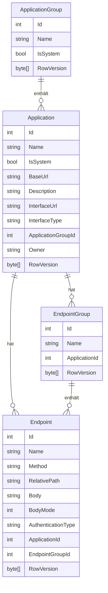

# Anwendungen — Datenmodell

## Entitäten

Die Entitäten `ApplicationGroup` und `Application` sind in `Schnittstellenzentrale.Core` definiert.

### `ApplicationGroup`

| Eigenschaft | Typ | Beschreibung |
|-------------|-----|--------------|
| `Id` | `int` | Primärschlüssel (automatisch vergeben) |
| `Name` | `string` | Anzeigename der Gruppe (Pflichtfeld) |
| `IsSystem` | `bool` | Kennzeichnet den Eintrag als systemseitig verwaltet; Default `false` |
| `RowVersion` | `byte[]` | Optimistische Nebenläufigkeitskontrolle |
| `Applications` | `IList<Application>` | Zugeordnete Anwendungen (Navigationseigenschaft) |

### `Application`

| Eigenschaft | Typ | Beschreibung |
|-------------|-----|--------------|
| `Id` | `int` | Primärschlüssel (automatisch vergeben) |
| `Name` | `string` | Anzeigename der Anwendung (Pflichtfeld) |
| `IsSystem` | `bool` | Kennzeichnet den Eintrag als systemseitig verwaltet; Default `false` |
| `BaseUrl` | `string` | Basis-URL des Dienstes (Pflichtfeld) |
| `Description` | `string?` | Optionale Beschreibung |
| `InterfaceUrl` | `string?` | Optionale URL zur API-Beschreibung (Swagger/OpenAPI oder OData) |
| `InterfaceType` | `InterfaceType` | Automatisch erkannter Schnittstellentyp (`Rest`, `OData`, `Unknown`) |
| `ApplicationGroupId` | `int?` | Fremdschlüssel zur zugeordneten Gruppe (optional) |
| `Owner` | `string?` | Windows-Benutzername des Eigentümers; nur im Benutzermodus gesetzt |
| `RowVersion` | `byte[]` | Optimistische Nebenläufigkeitskontrolle |

### `EndpointGroup`

| Eigenschaft | Typ | Beschreibung |
|-------------|-----|--------------|
| `Id` | `int` | Primärschlüssel (automatisch vergeben) |
| `Name` | `string` | Anzeigename des Ordners (Pflichtfeld) |
| `ApplicationId` | `int` | Fremdschlüssel zur zugehörigen Anwendung |
| `RowVersion` | `byte[]` | Optimistische Nebenläufigkeitskontrolle |
| `Endpoints` | `ICollection<Endpoint>` | Enthaltene Endpunkte (Navigationseigenschaft) |

### `Endpoint`

| Eigenschaft | Typ | Beschreibung |
|-------------|-----|--------------|
| `Id` | `int` | Primärschlüssel (automatisch vergeben) |
| `Name` | `string` | Anzeigename des Endpunkts (Pflichtfeld) |
| `Method` | `HttpMethod` | HTTP-Methode (GET, POST, PUT, DELETE, PATCH, HEAD, OPTIONS) |
| `RelativePath` | `string` | Relativer Pfad, wird an `Application.BaseUrl` angehängt |
| `Body` | `string?` | Optionaler Request-Body |
| `BodyMode` | `BodyMode` | Steuert `Content-Type`-Automatik und Formatierungsfunktion; Default `None` |
| `AuthenticationType` | `AuthenticationType` | Authentifizierungstyp (None, Basic, Negotiate, BearerToken, NegotiateWithImpersonation) |
| `ApplicationId` | `int` | Fremdschlüssel zur zugehörigen Anwendung |
| `EndpointGroupId` | `int?` | Fremdschlüssel zum Ordner (optional; `null` = kein Ordner) |
| `RowVersion` | `byte[]` | Optimistische Nebenläufigkeitskontrolle |
| `Headers` | `ICollection<EndpointHeader>` | Request-Header (Navigationseigenschaft) |
| `QueryParameters` | `ICollection<EndpointQueryParameter>` | Query-Parameter (Navigationseigenschaft) |

### `BodyMode` (Enum)

| Wert | `Content-Type` |
|------|---------------|
| `None` | kein automatischer `Content-Type` |
| `Json` | `application/json` |
| `Xml` | `application/xml` |
| `PlainText` | `text/plain` |

### `EndpointExecutionResult`

| Eigenschaft | Typ | Beschreibung |
|-------------|-----|--------------|
| `Success` | `bool` | `true` bei HTTP-2xx-Statuscode |
| `StatusCode` | `int?` | HTTP-Statuscode der Antwort |
| `RequestDetails` | `string?` | Zusammenfassung der gesendeten Anfrage |
| `ResponseBody` | `string?` | Antwort-Body als Text |
| `ErrorMessage` | `string?` | Fehlermeldung bei Verbindungs- oder Laufzeitfehlern |
| `ResponseHeaders` | `IDictionary<string, string>?` | Zusammengeführte Antwort-Header (Response-Headers + Content-Headers) |
| `DurationMs` | `long?` | Anfragedauer in Millisekunden (gemessen via `Stopwatch`) |
| `ResponseSizeBytes` | `long?` | Byte-Länge des Antwort-Body (UTF-8) |

## Beziehungen

Eine `ApplicationGroup` kann keine oder beliebig viele `Application`-Einträge enthalten. Die Zuordnung ist optional: Eine `Application` kann auch ohne Gruppe (`ApplicationGroupId = null`) existieren.

Eine `Application` kann beliebig viele `EndpointGroup`- und `Endpoint`-Einträge enthalten. Beim Löschen einer Anwendung werden alle zugehörigen Gruppen und Endpunkte kaskadierend mitgelöscht (`DeleteBehavior.Cascade`).

Eine `EndpointGroup` kann beliebig viele `Endpoint`-Einträge enthalten. Beim Löschen einer Gruppe werden alle enthaltenen Endpunkte kaskadierend mitgelöscht (`DeleteBehavior.Cascade`). Ein Endpunkt ohne Gruppe hat `EndpointGroupId = null`.

Beim Löschen einer `ApplicationGroup` setzt EF Core `ApplicationGroupId` der enthaltenen Anwendungen auf `null` (`DeleteBehavior.SetNull`). Das UI-seitige explizite Entkoppeln in `ApplicationGroupTree` ist trotzdem erforderlich, damit SignalR-Benachrichtigungen für die einzelnen Anwendungen ausgelöst werden.

## Diagramm

