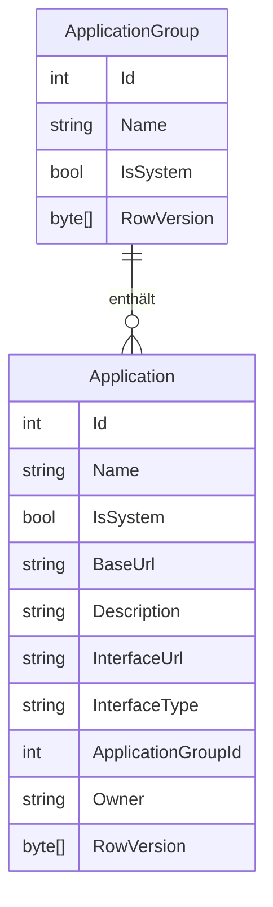

# Anwendungen — Datenmodell

## Entitäten

Die Entitäten `ApplicationGroup` und `Application` sind in `Schnittstellenzentrale.Core` definiert.

### `ApplicationGroup`

| Eigenschaft | Typ | Beschreibung |
|-------------|-----|--------------|
| `Id` | `int` | Primärschlüssel (automatisch vergeben) |
| `Name` | `string` | Anzeigename der Gruppe (Pflichtfeld) |
| `IsSystem` | `bool` | Kennzeichnet den Eintrag als systemseitig verwaltet; Default `false` |
| `RowVersion` | `byte[]` | Optimistische Nebenläufigkeitskontrolle |
| `Applications` | `IList<Application>` | Zugeordnete Anwendungen (Navigationseigenschaft) |

### `Application`

| Eigenschaft | Typ | Beschreibung |
|-------------|-----|--------------|
| `Id` | `int` | Primärschlüssel (automatisch vergeben) |
| `Name` | `string` | Anzeigename der Anwendung (Pflichtfeld) |
| `IsSystem` | `bool` | Kennzeichnet den Eintrag als systemseitig verwaltet; Default `false` |
| `BaseUrl` | `string` | Basis-URL des Dienstes (Pflichtfeld) |
| `Description` | `string?` | Optionale Beschreibung |
| `InterfaceUrl` | `string?` | Optionale URL zur API-Beschreibung (Swagger/OpenAPI oder OData) |
| `InterfaceType` | `InterfaceType` | Automatisch erkannter Schnittstellentyp (`Rest`, `OData`, `Unknown`) |
| `ApplicationGroupId` | `int?` | Fremdschlüssel zur zugeordneten Gruppe (optional) |
| `Owner` | `string?` | Windows-Benutzername des Eigentümers; nur im Benutzermodus gesetzt |
| `RowVersion` | `byte[]` | Optimistische Nebenläufigkeitskontrolle |

## Beziehungen

Eine `ApplicationGroup` kann keine oder beliebig viele `Application`-Einträge enthalten. Die Zuordnung ist optional: Eine `Application` kann auch ohne Gruppe (`ApplicationGroupId = null`) existieren.

Beim Löschen einer Gruppe setzt EF Core `ApplicationGroupId` der enthaltenen Anwendungen auf `null` (`DeleteBehavior.SetNull`). Das UI-seitige explizite Entkoppeln in `ApplicationGroupTree` ist trotzdem erforderlich, damit SignalR-Benachrichtigungen für die einzelnen Anwendungen ausgelöst werden.

## Diagramm

