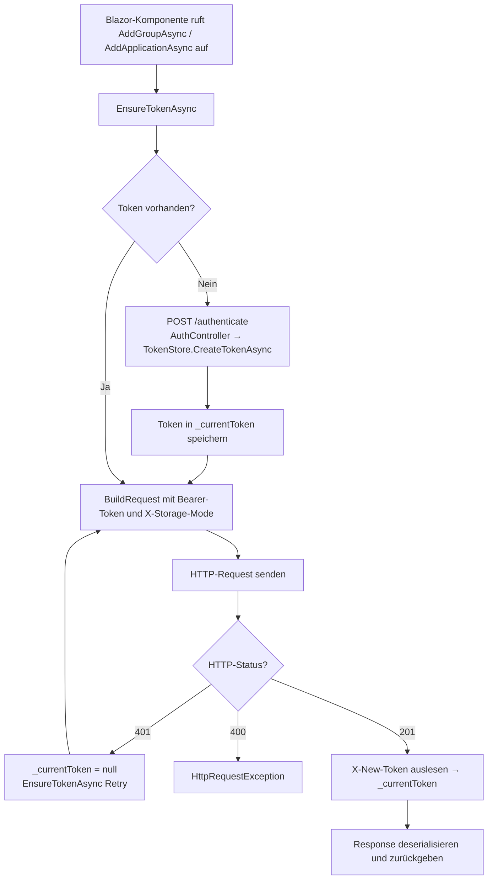

# REST-API — Technischer Ablauf

## Übersicht

Die API wird innerhalb der bestehenden Blazor-Server-Anwendung (`Schnittstellenzentrale`) gehostet. Controllers werden über `app.MapControllers()` eingebunden. Die Authentifizierung zwischen Blazor-Komponenten und der eigenen API erfolgt über ein Token-Rotations-Verfahren; die Token-Verwaltung übernimmt `TokenStore` als Singleton-Dienst.

---

## Ablauf 1: Authentifizierung — POST /authenticate

### 1. Request-Eingang

Der Client sendet `POST /authenticate` ohne Request-Body. Die ASP.NET Core-Authentifizierungsmiddleware (Negotiate/Windows) wertet die Windows-Identität des Aufrufers aus.

Beteiligte Komponenten:
- ASP.NET Core Negotiate-Middleware — ermittelt `HttpContext.User.Identity.Name`
- `AuthController` — ist mit `[AllowAnonymous]` markiert (Middleware läuft trotzdem, falls Windows-Auth konfiguriert)

### 2. Token erstellen

`AuthController.AuthenticateAsync` liest `HttpContext.User.Identity.Name`. Ist der Name leer, gibt der Controller `401 Unauthorized` zurück.

Ansonsten ruft er `ITokenStore.CreateTokenAsync(windowsUsername)` auf.

Beteiligte Komponenten:
- `AuthController.AuthenticateAsync` — Orchestrierung
- `ITokenStore.CreateTokenAsync` / `TokenStore.CreateTokenAsync` — erstellt `AuthToken` (neue GUID als `TokenValue`, `ExpiresAt = DateTime.UtcNow + 5 min`, `WindowsUsername`)

### 3. Response

`AuthController` gibt `200 OK` mit `AuthenticateResponse { Token = token.TokenValue }` zurück.

---

## Ablauf 2: Token-Validierung und -Rotation (gemeinsame Basis für Datenendpunkte)

Vor der eigentlichen Verarbeitung jedes Datenendpunkts läuft in `ApiControllerBase.ValidateTokenAndSetResponseHeaderAsync`:

1. `Authorization`-Header wird gelesen; fehlt das Bearer-Schema, gibt die Methode `null` zurück.
2. `ITokenStore.ValidateAndRotateAsync(tokenString)` wird aufgerufen.
3. `TokenStore.ValidateAndRotateAsync`:
   - Bereinigt zuerst abgelaufene Tokens (`RemoveExpiredTokens`).
   - Versucht, den Token aus `_tokens` (`ConcurrentDictionary`) zu entfernen (`TryRemove`).
   - Ist der Token nicht vorhanden oder bereits abgelaufen: gibt `null` zurück.
   - Ist der Token gültig: erstellt einen neuen `AuthToken` (neue GUID, neue Ablaufzeit, gleicher Benutzername) und speichert ihn.
4. Der neue Token wird im Response-Header `X-New-Token` gesetzt.
5. Der Controller prüft den Rückgabewert: ist er `null`, gibt er `401 Unauthorized` zurück und bricht ab.

Beteiligte Komponenten:
- `ApiControllerBase.ValidateTokenAndSetResponseHeaderAsync`
- `ApiControllerBase.ParseStorageMode`
- `ITokenStore` / `TokenStore`
- `AuthToken`

---

## Ablauf 3: Anlage einer ApplicationGroup — POST /api/application-groups

1. `ApplicationGroupsController.CreateAsync([FromBody] CreateApplicationGroupRequest request)` wird aufgerufen.
2. ASP.NET Core Model-Validation prüft `CreateApplicationGroupRequest` (Data-Annotations: `[Required]`, `[MaxLength(200)]`). Bei Fehler: `400 Bad Request`.
3. Token-Validierung und -Rotation (siehe Ablauf 2). Bei ungültigem Token: `401 Unauthorized`.
4. `ParseStorageMode()` liest `X-Storage-Mode`-Header: `"Team"` → `StorageMode.Team`, sonst `StorageMode.User`.
5. Neues `ApplicationGroup`-Objekt wird erstellt: `Name = request.Name`.
6. `IApplicationRepository.AddGroupAsync(group)` wird aufgerufen.
7. Bei `StorageMode.Team`: `ISignalRNotificationService.NotifyGroupChangedAsync(saved.Id)`.
8. Response: `201 Created` mit `Location`-Header, `X-New-Token`-Header und `ApplicationGroupResponse { Id, Name }`.

Beteiligte Komponenten:
- `ApplicationGroupsController`
- `CreateApplicationGroupRequest`, `ApplicationGroupResponse`
- `IApplicationRepository`, `ISignalRNotificationService`
- `ApiControllerBase`, `ITokenStore`

---

## Ablauf 4: Anlage einer Application — POST /api/applications

1. `ApplicationsController.CreateAsync([FromBody] CreateApplicationRequest request)` wird aufgerufen.
2. Model-Validation prüft Pflichtfelder (`Name`, `BaseUrl`) und optionale Längenbeschränkungen (`InterfaceUrl`, `Owner`). Bei Fehler: `400 Bad Request`.
3. Token-Validierung (siehe Ablauf 2). Bei ungültigem Token: `401 Unauthorized`.
4. `ParseStorageMode()` liest `X-Storage-Mode`-Header.
5. Neues `Application`-Objekt wird erstellt; `InterfaceType` wird via `Application.DetectInterfaceType(request.InterfaceUrl)` abgeleitet.
6. `IApplicationRepository.AddApplicationAsync(application)` wird aufgerufen.
7. Bei `StorageMode.Team`: `ISignalRNotificationService.NotifyApplicationChangedAsync(saved.Id)`.
8. Response: `201 Created` mit `Location`-Header, `X-New-Token`-Header und `ApplicationResponse { Id, Name, BaseUrl, ApplicationGroupId }`.

Beteiligte Komponenten:
- `ApplicationsController`
- `CreateApplicationRequest`, `ApplicationResponse`
- `Application.DetectInterfaceType`
- `IApplicationRepository`, `ISignalRNotificationService`
- `ApiControllerBase`, `ITokenStore`

---

## Ablauf 5: Abruf von EndpointGroups — GET /api/endpoint-groups

1. `EndpointGroupsController.GetAllAsync([FromQuery] int applicationId)` wird aufgerufen.
2. Token-Validierung und -Rotation (siehe Ablauf 2). Bei ungültigem Token: `401 Unauthorized`.
3. `ParseStorageMode()` liest `X-Storage-Mode`-Header.
4. `IEndpointRepository.GetEndpointGroupsAsync(applicationId)` wird aufgerufen.
5. Jede `EndpointGroup` wird via `ApiControllerBase.MapToResponse(EndpointGroup)` auf `EndpointGroupResponse` gemappt.
6. Response: `200 OK` mit Liste von `EndpointGroupResponse` und `X-New-Token`-Header.

Beteiligte Komponenten:
- `EndpointGroupsController`
- `ApiControllerBase.MapToResponse(EndpointGroup)` — statische Mapping-Methode
- `EndpointGroupResponse`
- `IEndpointRepository`, `ITokenStore`

---

## Ablauf 6: Anlage einer EndpointGroup — POST /api/endpoint-groups

1. `EndpointGroupsController.CreateAsync([FromBody] CreateEndpointGroupRequest request)` wird aufgerufen.
2. Model-Validation prüft Pflichtfelder (`Name`, `ApplicationId`). Bei Fehler: `400 Bad Request`.
3. Token-Validierung und -Rotation (siehe Ablauf 2). Bei ungültigem Token: `401 Unauthorized`.
4. `ParseStorageMode()` liest `X-Storage-Mode`-Header.
5. Neues `EndpointGroup`-Objekt wird erstellt: `Name`, `ApplicationId`, `ParentGroupId`.
6. `IEndpointRepository.AddEndpointGroupAsync(group)` wird aufgerufen.
7. Bei `StorageMode.Team`: `ISignalRNotificationService.NotifyEndpointGroupChangedAsync(saved.Id, saved.ApplicationId)`.
8. Response: `201 Created` mit `Location`-Header, `X-New-Token`-Header und `EndpointGroupResponse`.

Beteiligte Komponenten:
- `EndpointGroupsController`
- `CreateEndpointGroupRequest`, `EndpointGroupResponse`
- `IEndpointRepository`, `ISignalRNotificationService`
- `ApiControllerBase`, `ITokenStore`

---

## Ablauf 7: Anlage eines Endpoint — POST /api/endpoints

1. `EndpointsController.CreateAsync([FromBody] CreateEndpointRequest request)` wird aufgerufen.
2. Model-Validation prüft Pflichtfelder (`Name`, `RelativePath`, `ApplicationId`). Bei Fehler: `400 Bad Request`.
3. Token-Validierung und -Rotation (siehe Ablauf 2). Bei ungültigem Token: `401 Unauthorized`.
4. `ParseStorageMode()` liest `X-Storage-Mode`-Header.
5. Neues `Endpoint`-Objekt wird erstellt mit allen Feldern aus dem Request, einschließlich `PreRequestScript`, `PostRequestScript`, `AuthenticationType`.
6. `IEndpointRepository.AddEndpointAsync(endpoint)` wird aufgerufen.
7. Bei `StorageMode.Team`: `ISignalRNotificationService.NotifyEndpointChangedAsync(saved.Id, saved.ApplicationId)`.
8. Controller mappt das gespeicherte `Endpoint` via `ApiControllerBase.MapToResponse(Endpoint)` auf `EndpointResponse` (inkl. `Headers` und `QueryParameters`).
9. Response: `201 Created` mit `Location`-Header, `X-New-Token`-Header und `EndpointResponse`.

Beteiligte Komponenten:
- `EndpointsController`
- `CreateEndpointRequest`, `EndpointResponse`
- `ApiControllerBase.MapToResponse(Endpoint)` — statische Mapping-Methode inkl. `Headers` und `QueryParameters`
- `IEndpointRepository`, `ISignalRNotificationService`
- `ApiControllerBase`, `ITokenStore`

---

## Ablauf 8: Hinzufügen eines Headers — POST /api/endpoints/headers

1. `EndpointsController.AddHeaderAsync([FromBody] AddEndpointHeaderRequest request)` wird aufgerufen.
2. Model-Validation prüft `Key` und `EndpointId`. Bei Fehler: `400 Bad Request`.
3. Token-Validierung und -Rotation (siehe Ablauf 2). Bei ungültigem Token: `401 Unauthorized`.
4. Neues `EndpointHeader`-Objekt wird aus `Key`, `Value`, `EndpointId` erstellt.
5. `IEndpointRepository.AddHeaderAsync(header)` wird aufgerufen.
6. Response: `201 Created` mit `EndpointHeaderResponse` und `X-New-Token`-Header.

Beteiligte Komponenten:
- `EndpointsController`
- `AddEndpointHeaderRequest`, `EndpointHeaderResponse`
- `IEndpointRepository`
- `ApiControllerBase`, `ITokenStore`

---

## Ablauf 9: REST-Client (ApplicationApiClient)

`ApplicationApiClient` implementiert `IApplicationApiClient` und kapselt die gesamte Kommunikation mit der eigenen API. Er wird per `AddHttpClient<IApplicationApiClient, ApplicationApiClient>` mit der Basis-URL aus `Api:BaseUrl` registriert.

### Token-Verwaltung im Client

- `_currentToken` (privates Feld, `string?`) speichert den aktuellen Token in-memory.
- `_tokenLock` (`SemaphoreSlim(1,1)`) schützt den Zugriff auf `_currentToken`.
- `EnsureTokenAsync()` ruft `POST /authenticate` auf, falls `_currentToken` leer ist.

### Senden eines Requests

`SendWithTokenAsync<TResponse>` führt folgende Schritte durch:

1. `EnsureTokenAsync()` — stellt sicher, dass ein Token vorhanden ist.
2. `BuildGetRequest(relativeUrl)` oder `BuildRequestWithBody(method, relativeUrl, body)` oder `BuildDeleteRequest(relativeUrl)` — erstellt `HttpRequestMessage` mit Bearer-Token im `Authorization`-Header und optionalem `X-Storage-Mode`-Header.
3. `_httpClient.SendAsync(request)`.
4. Bei `401 Unauthorized`: `_currentToken = null`, erneut `EnsureTokenAsync()`, dann Wiederholung des Requests.
5. `response.EnsureSuccessStatusCode()`.
6. `X-New-Token`-Header auslesen → `_currentToken` aktualisieren.
7. Response-Body deserialisieren und zurückgeben.

Für `GET`-Anfragen, bei denen ein `null`-Ergebnis bei 404 erwartet wird, wird `SendWithTokenNullableAsync` verwendet, das `null` statt einer Exception bei `404 Not Found` zurückgibt.

### Neue Methoden für Endpunktgruppen und Endpunkte

| Methode | HTTP | Pfad | Mapping |
|---------|------|------|---------|
| `GetEndpointGroupsAsync(applicationId)` | GET | `/api/endpoint-groups?applicationId={id}` | `MapToEndpointGroup` auf jedes DTO |
| `GetEndpointGroupByIdAsync(id)` | GET | `/api/endpoint-groups/{id}` | `MapToEndpointGroup`, `null` bei 404 |
| `AddEndpointGroupAsync(group)` | POST | `/api/endpoint-groups` | `MapToEndpointGroup` |
| `UpdateEndpointGroupAsync(group)` | PUT | `/api/endpoint-groups/{id}` | `MapToEndpointGroup` |
| `DeleteEndpointGroupAsync(id)` | DELETE | `/api/endpoint-groups/{id}` | — |
| `GetEndpointsAsync(applicationId)` | GET | `/api/endpoints?applicationId={id}` | `MapToEndpoint` auf jedes DTO |
| `GetEndpointByIdAsync(id)` | GET | `/api/endpoints/{id}` | `MapToEndpoint`, `null` bei 404 |
| `AddEndpointAsync(endpoint)` | POST | `/api/endpoints` | `MapToEndpoint` |
| `UpdateEndpointAsync(endpoint)` | PUT | `/api/endpoints/{id}` | `MapToEndpoint` |
| `DeleteEndpointAsync(id)` | DELETE | `/api/endpoints/{id}` | — |
| `AddHeaderAsync(header)` | POST | `/api/endpoints/headers` | `EndpointHeaderResponse` → `EndpointHeader` |
| `DeleteHeaderAsync(id)` | DELETE | `/api/endpoints/headers/{id}` | — |
| `AddQueryParameterAsync(parameter)` | POST | `/api/endpoints/query-parameters` | `EndpointQueryParameterResponse` → `EndpointQueryParameter` |
| `DeleteQueryParameterAsync(id)` | DELETE | `/api/endpoints/query-parameters/{id}` | — |

`MapToEndpoint` mappt `EndpointResponse` auf `Endpoint`-Domänenobjekt inklusive `Headers`- und `QueryParameters`-Collections.

Beteiligte Komponenten:
- `ApplicationApiClient`
- `EndpointGroupResponse`, `EndpointResponse`, `EndpointHeaderResponse`, `EndpointQueryParameterResponse`

---

## Diagramm

---

## Fehlerbehandlung

| Fehlerfall | Verhalten |
|-----------|-----------|
| `Authorization`-Header fehlt oder kein Bearer-Schema | `ApiControllerBase` gibt `null` zurück → Controller antwortet `401 Unauthorized` |
| Token unbekannt oder abgelaufen | `TokenStore.ValidateAndRotateAsync` gibt `null` zurück → `401 Unauthorized` |
| Pflichtfeld fehlt oder zu lang | ASP.NET Core Model-Validation → `400 Bad Request` mit Problem-Details |
| `POST /authenticate` schlägt fehl | `ApplicationApiClient.EnsureTokenAsync` wirft `InvalidOperationException` |
| Sonstiger HTTP-Fehler bei Datenendpunkt | `response.EnsureSuccessStatusCode()` wirft `HttpRequestException` |
| Response-Deserialisierung gibt `null` | `InvalidOperationException: Response deserialization returned null.` |
