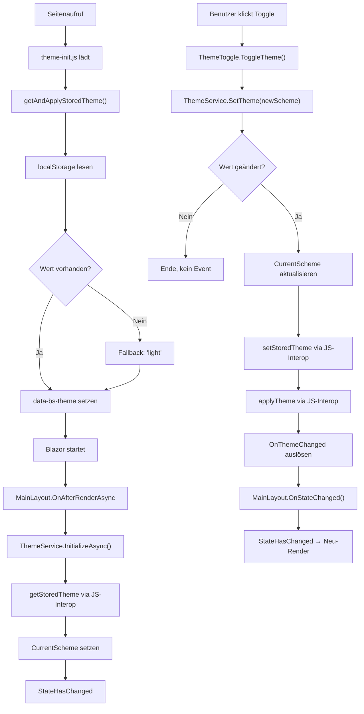

# Dark Mode — Technischer Ablauf

## Übersicht

Das Theme-System besteht aus zwei unabhängigen Abläufen: einem synchronen Initialisierungspfad beim Seitenaufruf (via `theme-init.js`) und einem asynchronen Laufzeitpfad nach dem Blazor-Start (via `ThemeService`). Beide Pfade schreiben dasselbe `data-bs-theme`-Attribut am `<html>`-Element und denselben `localStorage`-Schlüssel.

## Ablauf

### 1. Frühzeitige Theme-Initialisierung (vor Blazor-Render)

`App.razor` bindet `theme-init.js` als `<script type="module">` im `<head>` ein. Das Modul ruft sofort `getAndApplyStoredTheme()` auf:

1. Liest `localStorage.getItem('colorScheme')`.
2. Verwendet `'light'` als Fallback, wenn kein Wert vorhanden ist.
3. Setzt `document.documentElement.setAttribute('data-bs-theme', scheme.toLowerCase())`.

Beteiligte Komponenten:
- `App.razor` — bindet `theme-init.js` ein
- `theme-init.js` — ruft `theme.js`-Funktion `getAndApplyStoredTheme` auf
- `theme.js` — liest `localStorage`, setzt `data-bs-theme`

### 2. Blazor-seitige Initialisierung

Nach dem ersten Render von `MainLayout` wird `OnAfterRenderAsync(firstRender: true)` aufgerufen:

1. `MainLayout` ruft `ThemeService.InitializeAsync()` auf.
2. `ThemeService` importiert `theme.js` als ES-Modul via `IJSRuntime.InvokeAsync<IJSObjectReference>("import", "./theme.js")`.
3. Das Modul-Objekt wird gecacht in `_module`.
4. `ThemeService` ruft `module.InvokeAsync<string?>("getStoredTheme")` auf, um den gespeicherten Wert zu lesen.
5. Wenn ein gültiger `ColorScheme`-Wert gefunden wird, setzt `ThemeService.CurrentScheme` entsprechend.
6. `MainLayout` ruft `InvokeAsync(StateHasChanged)` auf, um sich neu zu rendern.

Beteiligte Komponenten:
- `MainLayout` — `OnAfterRenderAsync`, `_themeInitialized`-Flag
- `ThemeService.InitializeAsync()` — liest gespeicherten Wert
- `theme.js` — Funktion `getStoredTheme`

### 3. Theme-Wechsel durch den Benutzer

Der Benutzer klickt auf den `ThemeToggle`-Button in der Top-Row:

1. `ThemeToggle.ToggleTheme()` ermittelt den jeweils anderen `ColorScheme`-Wert.
2. `ThemeToggle` ruft `ThemeService.SetTheme(newScheme)` auf.
3. `ThemeService.SetTheme()` prüft, ob sich der Wert tatsächlich geändert hat (kein Doppel-Event).
4. `CurrentScheme` wird aktualisiert.
5. `ThemeService` ruft `PersistTheme(scheme)` auf:
   - `module.InvokeVoidAsync("setStoredTheme", scheme.ToString())` — schreibt in `localStorage`
   - `module.InvokeVoidAsync("applyTheme", scheme.ToString())` — setzt `data-bs-theme` am `<html>`-Element
6. `OnThemeChanged` wird ausgelöst.
7. `MainLayout.OnStateChanged()` empfängt das Event und ruft `InvokeAsync(StateHasChanged)` auf.
8. `ThemeToggle` rendert neu und zeigt das passende Icon.

Beteiligte Komponenten:
- `ThemeToggle` — `ToggleTheme()`, Icon-Render
- `ThemeService` — `SetTheme()`, `PersistTheme()`, `OnThemeChanged`
- `theme.js` — `setStoredTheme`, `applyTheme`
- `MainLayout` — `OnStateChanged()`, abonniert `IThemeService.OnThemeChanged`

## Diagramm

## Fehlerbehandlung

- `ThemeService.InitializeAsync()` führt nur dann `Enum.TryParse` durch und aktualisiert `CurrentScheme`, wenn der gelesene `localStorage`-Wert nicht `null` ist und einem gültigen `ColorScheme`-Wert entspricht. Ungültige oder fehlende Werte werden ignoriert; das Standardschema `Light` bleibt aktiv.
- Das `_module`-Feld in `ThemeService` wird lazy initialisiert: Nur beim ersten Zugriff wird das JS-Modul importiert und gecacht. Weitere Aufrufe verwenden das gecachte Objekt.
- Das `_themeInitialized`-Flag in `MainLayout` stellt sicher, dass `InitializeAsync()` nur beim ersten Render aufgerufen wird, auch wenn `OnAfterRenderAsync` mehrfach ausgelöst wird.
