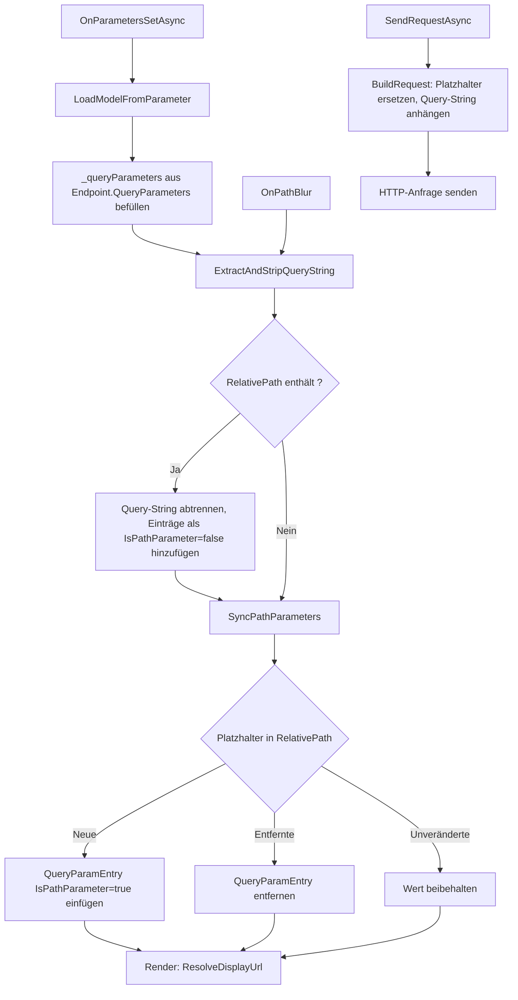

# Endpunkte — Technischer Ablauf

## Übersicht

`EndpointPage` ist die zentrale Razor-Komponente für die Endpunkt-Bearbeitung. Sie verwaltet intern eine Liste von `RequestQueryParamsPanel.QueryParamEntry`-Objekten (`_queryParameters`), die sowohl Pfad-Platzhalter als auch reguläre Query-Parameter enthält. Die Unterscheidung erfolgt über das In-Memory-Flag `IsPathParameter`. Beim Laden, beim Verlassen des Pfadfelds und beim Speichern werden mehrere Hilfsmethoden koordiniert aufgerufen.

---

## Ablauf: Laden eines Endpunkts

### 1. Komponentenparameter empfangen

`EndpointPage.OnParametersSetAsync()` prüft, ob sich die `Endpoint.Id` geändert hat. Bei Änderung wird `LoadModelFromParameter()` aufgerufen.

Beteiligte Komponenten:
- `EndpointPage.OnParametersSetAsync()` — Einstiegspunkt für Parameteränderungen

### 2. Modell befüllen

`LoadModelFromParameter()` kopiert alle Felder von `Endpoint` in das lokale `_model` und befüllt `_queryParameters` aus `Endpoint.QueryParameters` — mit `IsPathParameter = false` als Startwert für alle Einträge.

Beteiligte Komponenten:
- `EndpointPage.LoadModelFromParameter()` — Modellinitialisierung
- `RequestQueryParamsPanel.QueryParamEntry` — In-Memory-Datenklasse mit `Key`, `Value`, `IsPathParameter`

### 3. Query-String extrahieren

`ExtractAndStripQueryString()` wird aufgerufen. Falls `_model.RelativePath` ein `?` enthält, wird der Query-String per `string.Split('?', 2)` abgetrennt. Jedes Schlüssel-Wert-Paar wird dekodiert (`Uri.UnescapeDataString`) und als neuer `QueryParamEntry` mit `IsPathParameter = false` in `_queryParameters` eingefügt — sofern kein Eintrag mit demselben Key bereits vorhanden ist. `_model.RelativePath` wird auf den Teil vor dem `?` gesetzt.

Beteiligte Komponenten:
- `EndpointPage.ExtractAndStripQueryString()` — Query-String-Extraktion und Pfadbereinigung

### 4. Pfad-Platzhalter synchronisieren

`SyncPathParameters()` wendet den Regex `\{([^}]+)\}` auf `_model.RelativePath` an. Für jeden gefundenen Platzhalternamen gilt:

- Kein vorhandener Eintrag mit `IsPathParameter = true` und diesem Key → neuer `QueryParamEntry` mit `IsPathParameter = true` wird am Listenanfang eingefügt.
- Bereits vorhandener Eintrag → bleibt unverändert (Value wird beibehalten).
- Vorhandene Einträge mit `IsPathParameter = true`, deren Key nicht mehr im Pfad vorkommt, werden entfernt.

Beteiligte Komponenten:
- `EndpointPage.SyncPathParameters()` — Platzhalter-Erkennung und Listensynchronisation

### 5. Anzeige aufbauen

Das Pfadfeld rendert `ResolveDisplayUrl()`. Diese Methode iteriert über `_queryParameters`:

- Einträge, deren Key als `{Key}` im Pfad vorkommt: Platzhalter wird durch `Uri.EscapeDataString(Value)` ersetzt.
- Übrige Einträge (ohne Platzhalter-Treffer): werden als `key=value`-Paare in einem Query-String gesammelt und mit `?` angehängt.

Beteiligte Komponenten:
- `EndpointPage.ResolveDisplayUrl()` — URL-Auflösung für die Anzeige
- `RequestQueryParamsPanel` — rendert die Parameterliste; Sortierung via `OrderByDescending(p => p.IsPathParameter)`

---

## Ablauf: Bearbeitung des Pfadfelds

### 1. Anwender verlässt das Pfadfeld

Der `@onblur`-Handler `OnPathBlur()` wird ausgelöst.

### 2. Verarbeitung in OnPathBlur

`OnPathBlur()` ruft sequenziell auf:

1. `ExtractAndStripQueryString()` — extrahiert ggf. neuen Query-String-Anteil
2. `SyncPathParameters()` — gleicht Platzhalter ab
3. `MarkDirty()` — markiert den Endpunkt als geändert und aktiviert Navigation Guards

Das Pfadfeld aktualisiert sich durch Re-Render mit dem neuen Rückgabewert von `ResolveDisplayUrl()`.

Beteiligte Komponenten:
- `EndpointPage.OnPathBlur()` — blur-Handler
- `EndpointPage.MarkDirty()` — setzt `_isDirty = true`, registriert `RegisterLocationChangingHandler` und aktiviert `window.onbeforeunload`

### 3. Änderung eines Query-Parameter-Werts

Sobald ein Name- oder Wert-Eingabefeld im `RequestQueryParamsPanel` verlassen wird (`@onchange`), ruft `OnFieldChanged` das `OnChanged`-Callback auf. `EndpointPage` empfängt dieses Event und rendert neu, wodurch das Pfadfeld die aktualisierte aufgelöste URL anzeigt.

Beteiligte Komponenten:
- `RequestQueryParamsPanel.OnFieldChanged()` — Event-Handler für Feldänderungen
- `EndpointPage` — empfängt `OnChanged` und rendert neu

---

## Ablauf: Speichern

`EndpointPage.SaveAsync()` baut `_model.QueryParameters` aus `_queryParameters` auf: sowohl Einträge mit `IsPathParameter = true` als auch `false` werden als gleichartige `EndpointQueryParameter`-Objekte übernommen (kein `IsPathParameter`-Feld in der Datenbank). Anschließend delegiert `SaveAsync()` an `PersistAsync()`.

Beteiligte Komponenten:
- `EndpointPage.SaveAsync()` — Persistierungslogik
- `EndpointQueryParameter` — Datenbankmodell ohne `IsPathParameter`

---

## Ablauf: HTTP-Anfrage senden

### 1. Auslöser

`EndpointPage.SendRequestAsync()` ruft `ExecutionService.ExecuteAsync(refreshed)` auf.

### 2. URL-Aufbau in BuildRequest

`EndpointExecutionService.BuildRequest()` iteriert über alle `endpoint.QueryParameters`:

- Key als `{Key}` im Template vorhanden → `relativePath.Replace("{Key}", Uri.EscapeDataString(Value))`
- Key nicht im Template → wird in `queryParams`-Liste gesammelt

Die endgültige URL wird zusammengesetzt:
```
baseUrl.TrimEnd('/') + "/" + resolvedPath.TrimStart('/')
```
Bei vorhandenen `queryParams` wird `?key=value&...` angehängt.

Beteiligte Komponenten:
- `EndpointExecutionService.BuildRequest()` — URL-Zusammensetzung mit Platzhalter-Ersetzung
- `EndpointExecutionService.ExecuteAsync()` — Authentifizierung und HTTP-Ausführung

---

## Diagramm



---

## Fehlerbehandlung

- `SaveAsync()` fängt `DbUpdateConcurrencyException` und zeigt den `ConcurrencyWarningDialog`.
- `ExecuteAsync()` fängt allgemeine Ausnahmen und gibt ein `EndpointExecutionResult` mit `Success = false` und `ErrorMessage` zurück.
- Einträge mit leerem `Key` werden in `BuildRequest()` und in `ResolveDisplayUrl()` übersprungen.
