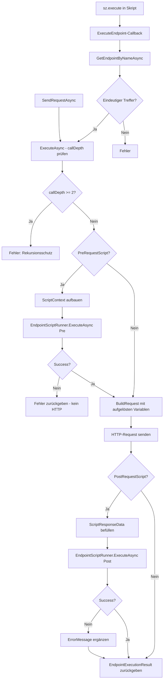
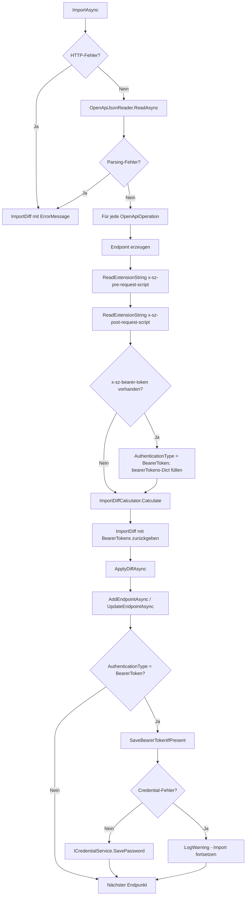

# Endpunkte — Technischer Ablauf

## Übersicht

`EndpointPage` ist die zentrale Razor-Komponente für die Endpunkt-Bearbeitung. Sie verwaltet intern eine Liste von `RequestQueryParamsPanel.QueryParamEntry`-Objekten (`_queryParameters`), die sowohl Pfad-Platzhalter als auch reguläre Query-Parameter enthält. Die Unterscheidung erfolgt über das In-Memory-Flag `IsPathParameter`. Beim Laden, beim Verlassen des Pfadfelds und beim Speichern werden mehrere Hilfsmethoden koordiniert aufgerufen.

---

## Ablauf: Laden eines Endpunkts

### 1. Komponentenparameter empfangen

`EndpointPage.OnParametersSetAsync()` prüft, ob sich die `Endpoint.Id` geändert hat. Bei Änderung wird `LoadModelFromParameter()` aufgerufen.

Beteiligte Komponenten:
- `EndpointPage.OnParametersSetAsync()` — Einstiegspunkt für Parameteränderungen

### 2. Modell befüllen

`LoadModelFromParameter()` kopiert alle Felder von `Endpoint` in das lokale `_model` und befüllt `_queryParameters` aus `Endpoint.QueryParameters` — mit `IsPathParameter = false` als Startwert für alle Einträge.

Beteiligte Komponenten:
- `EndpointPage.LoadModelFromParameter()` — Modellinitialisierung
- `RequestQueryParamsPanel.QueryParamEntry` — In-Memory-Datenklasse mit `Key`, `Value`, `IsPathParameter`

### 3. Query-String extrahieren

`ExtractAndStripQueryString()` wird aufgerufen. Falls `_model.RelativePath` ein `?` enthält, wird der Query-String per `string.Split('?', 2)` abgetrennt. Jedes Schlüssel-Wert-Paar wird dekodiert (`Uri.UnescapeDataString`) und als neuer `QueryParamEntry` mit `IsPathParameter = false` in `_queryParameters` eingefügt — sofern kein Eintrag mit demselben Key bereits vorhanden ist. `_model.RelativePath` wird auf den Teil vor dem `?` gesetzt.

Beteiligte Komponenten:
- `EndpointPage.ExtractAndStripQueryString()` — Query-String-Extraktion und Pfadbereinigung

### 4. Pfad-Platzhalter synchronisieren

`SyncPathParameters()` wendet den Regex `\{([^}]+)\}` auf `_model.RelativePath` an. Für jeden gefundenen Platzhalternamen gilt:

- Kein vorhandener Eintrag mit `IsPathParameter = true` und diesem Key → neuer `QueryParamEntry` mit `IsPathParameter = true` wird am Listenanfang eingefügt.
- Bereits vorhandener Eintrag → bleibt unverändert (Value wird beibehalten).
- Vorhandene Einträge mit `IsPathParameter = true`, deren Key nicht mehr im Pfad vorkommt, werden entfernt.

Beteiligte Komponenten:
- `EndpointPage.SyncPathParameters()` — Platzhalter-Erkennung und Listensynchronisation

### 5. Anzeige aufbauen

Das Pfadfeld rendert `ResolveDisplayUrl()`. Diese Methode iteriert über `_queryParameters`:

- Einträge, deren Key als `{Key}` im Pfad vorkommt: Platzhalter wird durch `Uri.EscapeDataString(Value)` ersetzt.
- Übrige Einträge (ohne Platzhalter-Treffer): werden als `key=value`-Paare in einem Query-String gesammelt und mit `?` angehängt.

Beteiligte Komponenten:
- `EndpointPage.ResolveDisplayUrl()` — URL-Auflösung für die Anzeige
- `RequestQueryParamsPanel` — rendert die Parameterliste; Sortierung via `OrderByDescending(p => p.IsPathParameter)`

---

## Ablauf: Bearbeitung des Pfadfelds

### 1. Anwender verlässt das Pfadfeld

Der `@onblur`-Handler `OnPathBlur()` wird ausgelöst.

### 2. Verarbeitung in OnPathBlur

`OnPathBlur()` ruft sequenziell auf:

1. `ExtractAndStripQueryString()` — extrahiert ggf. neuen Query-String-Anteil
2. `SyncPathParameters()` — gleicht Platzhalter ab
3. `MarkDirty()` — markiert den Endpunkt als geändert und aktiviert Navigation Guards

Das Pfadfeld aktualisiert sich durch Re-Render mit dem neuen Rückgabewert von `ResolveDisplayUrl()`.

Beteiligte Komponenten:
- `EndpointPage.OnPathBlur()` — blur-Handler
- `EndpointPage.MarkDirty()` — setzt `_isDirty = true`, registriert `RegisterLocationChangingHandler` und aktiviert `window.onbeforeunload`

### 3. Änderung eines Query-Parameter-Werts

Sobald ein Name- oder Wert-Eingabefeld im `RequestQueryParamsPanel` verlassen wird (`@onchange`), ruft `OnFieldChanged` das `OnChanged`-Callback auf. `EndpointPage` empfängt dieses Event und rendert neu, wodurch das Pfadfeld die aktualisierte aufgelöste URL anzeigt.

Beteiligte Komponenten:
- `RequestQueryParamsPanel.OnFieldChanged()` — Event-Handler für Feldänderungen
- `EndpointPage` — empfängt `OnChanged` und rendert neu

---

## Ablauf: Speichern

`EndpointPage.SaveAsync()` baut `_model.QueryParameters` aus `_queryParameters` auf: sowohl Einträge mit `IsPathParameter = true` als auch `false` werden als gleichartige `EndpointQueryParameter`-Objekte übernommen (kein `IsPathParameter`-Feld in der Datenbank). Anschließend delegiert `SaveAsync()` an `PersistAsync()`.

Beteiligte Komponenten:
- `EndpointPage.SaveAsync()` — Persistierungslogik
- `EndpointQueryParameter` — Datenbankmodell ohne `IsPathParameter`

---

## Ablauf: HTTP-Anfrage senden

### 1. Auslöser

`EndpointPage.SendRequestAsync()` ruft `ExecutionService.ExecuteAsync(refreshed)` auf.

### 2. Rekursionsschutz-Initialisierung

`EndpointExecutionService.ExecuteAsync(endpoint)` legt ein leeres `Dictionary<int, int> callDepth` an und delegiert an die interne Überladung. Vor jeder Ausführung wird `callDepth[endpoint.Id]` geprüft: ist der Wert `>= 2`, wird sofort ein `EndpointExecutionResult { Success = false }` zurückgegeben.

Beteiligte Komponenten:
- `EndpointExecutionService.ExecuteAsync(endpoint, callDepth)` — Rekursionsschutz und Ausführungssteuerung

### 3. Pre-Request-Skript ausführen (optional)

Falls `endpoint.PreRequestScript` nicht leer ist, wird ein `ScriptContext` mit `ScriptRequestData` (Rohwerte vor Platzhalterauflösung), `IActiveEnvironmentService` und dem `ExecuteEndpoint`-Callback aufgebaut. `IEndpointScriptRunner.ExecuteAsync` wird aufgerufen.

- Bei `ScriptExecutionResult.Success == false`: `EndpointExecutionResult` mit `ErrorMessage` zurückgeben, Ausführung abbrechen — kein HTTP-Request.
- Bei Erfolg: Umgebungsvariablen ggf. durch `sz.environment.set()` bereits aktualisiert.

Beteiligte Komponenten:
- `EndpointExecutionService.BuildScriptContext()` — erstellt `ScriptContext`
- `EndpointScriptRunner.ExecuteAsync()` — führt das Skript im Jint-Interpreter aus
- `ScriptContext` / `ScriptRequestData` / `ScriptExecutionResult`

### 4. URL-Aufbau und HTTP-Anfrage senden

`EndpointExecutionService.BuildRequest()` löst `{{...}}`-Platzhalter in Basis-URL, relativem Pfad, Header-Namen/-Werten und Body via `IActiveEnvironmentService.ActiveVariables` auf — die vom Pre-Skript ggf. geänderten Werte sind bereits enthalten. Anschließend werden `{pfadparameter}` ersetzt und Query-Parameter angehängt.

Die endgültige URL wird zusammengesetzt:
```
baseUrl.TrimEnd('/') + "/" + resolvedPath.TrimStart('/')
```

Beteiligte Komponenten:
- `EndpointExecutionService.BuildRequest()` — URL-Zusammensetzung mit Platzhalter-Ersetzung
- `EndpointExecutionService.ExecuteWithAuthAsync()` / `ExecuteImpersonatedAsync()` — Authentifizierung und HTTP-Ausführung

### 5. Post-Request-Skript ausführen (optional)

Falls `endpoint.PostRequestScript` nicht leer ist, wird `ScriptResponseData` aus der HTTP-Antwort befüllt (Body, Headers) und der `ScriptContext` damit erweitert. `IEndpointScriptRunner.ExecuteAsync` wird aufgerufen.

- Bei `ScriptExecutionResult.Success == false`: `EndpointExecutionResult.ErrorMessage` wird gesetzt oder ergänzt; das HTTP-Ergebnis bleibt erhalten.

Beteiligte Komponenten:
- `EndpointScriptRunner.ExecuteAsync()` — führt das Post-Skript aus
- `ScriptResponseData` — Snapshot der HTTP-Antwort

### 6. Ergebnis zurückgeben

`callDepth[endpoint.Id]` wird dekrementiert; das `EndpointExecutionResult` wird zurückgegeben.

---

## Ablauf: `sz.execute()` im Skript

1. Das Skript ruft `sz.execute(name)` auf.
2. `EndpointScriptRunner` ruft den `ExecuteEndpoint`-Callback im `ScriptContext` auf via `Task.Run(...).GetAwaiter().GetResult()`.
3. `EndpointExecutionService` sucht via `IEndpointRepository.GetEndpointByNameAsync(applicationId, name)` nach dem Endpunkt. Bei 0 oder mehreren Treffern wird ein Fehler zurückgegeben.
4. `ExecuteAsync` wird rekursiv mit dem bestehenden `callDepth` aufgerufen. Der Rekursionsschutz greift bei `callDepth[id] >= 2`.
5. Das Ergebnis wird als JavaScript-Objekt zurückgegeben: `{ success, statusCode, responseBody, errorMessage }`.

Beteiligte Komponenten:
- `EndpointScriptRunner` — synchroner Callback-Aufruf
- `EndpointExecutionService.ExecuteEndpoint`-Callback — Endpunkt-Lookup und rekursiver Aufruf
- `IEndpointRepository.GetEndpointByNameAsync()` — Namens-Lookup

---

## Ablauf: Swagger-Import mit Erweiterungsfeldern

### 1. Auslöser

Die UI ruft `ISwaggerImportService.ImportAsync(application)` auf.

### 2. Swagger-Definition laden und parsen

`SwaggerImportService.ImportAsync` lädt das Swagger-JSON per HTTP über `IHttpClientFactory` und parst es mit `OpenApiJsonReader`. Treten Parsing-Fehler auf, wird ein `ImportDiff { ErrorMessage = ... }` zurückgegeben.

Beteiligte Komponenten:
- `SwaggerImportService.ImportAsync` — HTTP-Abruf und Parsing
- `OpenApiJsonReader` — Parsing der OpenAPI-Definition

### 3. Endpunkte mit Erweiterungsfeldern erzeugen

Für jede `OpenApiOperation` in `document.Paths` wird ein `Endpoint` erzeugt. Zusätzlich zu `Name`, `Method`, `RelativePath` und `ApplicationId` werden folgende Felder gesetzt:

- `x-sz-pre-request-script` → `Endpoint.PreRequestScript`
- `x-sz-post-request-script` → `Endpoint.PostRequestScript`
- `x-sz-bearer-token` → `Endpoint.AuthenticationType = BearerToken`; Token-Wert wird unter dem Schlüssel `"{Method}:{RelativePath}"` in einem lokalen Dictionary gesammelt.

Fehlende Erweiterungsfelder belassen die Felder auf `null` bzw. `None`.

Beteiligte Komponenten:
- `SwaggerImportService.ReadExtensionString(extensions, key)` — liest einen OpenAPI-Erweiterungswert als `string?`; gibt `null` zurück, wenn der Schlüssel fehlt oder der Wert kein String ist
- `ImportDiff.BearerTokens` (`IDictionary<string, string>`) — transportiert die Token-Werte zwischen `ImportAsync` und `ApplyDiffAsync`

### 4. Diff berechnen

`ImportDiffCalculator.Calculate(existing, imported)` vergleicht bestehende und importierte Endpunkte. `ImportDiffCalculator.HasChanged` berücksichtigt jetzt auch `PreRequestScript` und `PostRequestScript`. `ImportDiffCalculator.MergeExistingIdentity` überträgt diese Felder vom importierten Endpunkt auf den zusammengeführten Eintrag (einschließlich `null`-Werte).

Beteiligte Komponenten:
- `ImportDiffCalculator.Calculate` — Diff-Berechnung
- `ImportDiffCalculator.HasChanged` — Änderungserkennung inkl. Skriptfelder
- `ImportDiffCalculator.MergeExistingIdentity` — Zusammenführung mit bestehender Identität

Das lokale Bearer-Token-Dictionary wird als `ImportDiff.BearerTokens` in das zurückgegebene `ImportDiff` übernommen.

### 5. Diff anwenden

Die UI ruft `ISwaggerImportService.ApplyDiffAsync(diff)` auf. Für neue und geänderte Endpunkte werden zunächst die Datenbankoperationen ausgeführt (`IEndpointRepository.AddEndpointAsync` / `UpdateEndpointAsync`). Anschließend wird `SaveBearerTokenIfPresent` aufgerufen:

- `endpoint.AuthenticationType == BearerToken` → Schlüssel `"{Method}:{RelativePath}"` in `ImportDiff.BearerTokens` nachschlagen → `ICredentialService.SavePassword(credentialTarget, "", tokenValue)` aufrufen.
- Fehler beim Credential-Zugriff werden per `_logger.LogWarning` geloggt und unterbrechen den Import nicht.
- Der `credentialTarget` wird durch `CredentialTargetHelper.Build(applicationId, AuthenticationType.BearerToken)` erzeugt.

Beteiligte Komponenten:
- `SwaggerImportService.ApplyDiffAsync` — Persistierung und Credential-Ablage
- `SwaggerImportService.SaveBearerTokenIfPresent` — private Hilfsmethode für Credential-Speicherung
- `IEndpointRepository.AddEndpointAsync` / `UpdateEndpointAsync` — Datenbankoperationen
- `ICredentialService.SavePassword` — Ablage im Windows Credential Manager
- `CredentialTargetHelper.Build` — Schlüsselbildung für den Credential Manager

---

## Diagramm



---

## Diagramm: Swagger-Import



---

## Fehlerbehandlung

- `SaveAsync()` fängt `DbUpdateConcurrencyException` und zeigt den `ConcurrencyWarningDialog`.
- `ExecuteAsync()` fängt allgemeine Ausnahmen und gibt ein `EndpointExecutionResult` mit `Success = false` und `ErrorMessage` zurück.
- Pre-Skript-Fehler (Syntaxfehler, Runtime-Exception, Timeout) verhindern den HTTP-Request; `ErrorMessage` enthält die Fehlerbeschreibung.
- Post-Skript-Fehler hängen die Fehlermeldung an ein ansonsten vollständiges `EndpointExecutionResult` an.
- `EndpointScriptRunner` begrenzt die Skriptlaufzeit auf `ScriptTimeoutMs = 5000 ms` und den Arbeitsspeicher auf 4 MB.
- Einträge mit leerem `Key` werden in `BuildRequest()` und in `ResolveDisplayUrl()` übersprungen.
- Import-Fehler beim Laden oder Parsen des Swagger-JSONs erzeugen ein `ImportDiff { ErrorMessage = ... }` und verhindern jede weitere Verarbeitung.
- Fehler beim Schreiben in den Windows Credential Manager werden per `_logger.LogWarning` protokolliert; die restlichen Endpunkte des Imports werden trotzdem persistiert.
