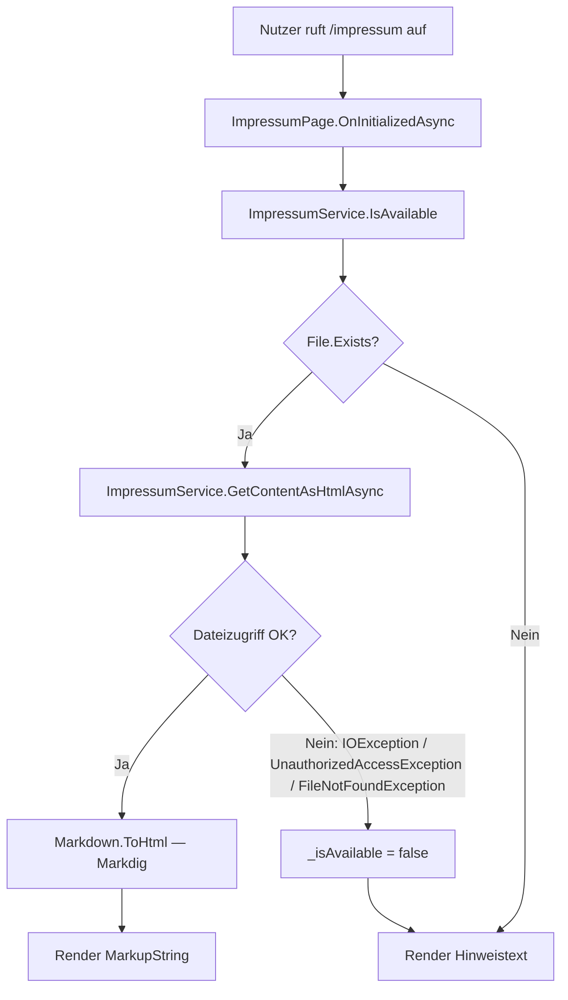

# Impressum — Technischer Ablauf

## Übersicht

Beim Seitenaufruf von `/impressum` prüft `ImpressumPage` über `IImpressumService.IsAvailable()`, ob die Datei existiert. Ist sie vorhanden, liest `ImpressumService.GetContentAsHtmlAsync()` den Inhalt und konvertiert ihn serverseitig via `Markdig` in HTML. Die Sidebar-Komponente `WorkspacesSidebar` ruft `IsAvailable()` beim Rendern direkt auf, um den Footer-Link bedingt auszugeben.

## Ablauf

### 1. Seitenaufruf `/impressum` — Datei vorhanden

Beteiligte Komponenten:
- `ImpressumPage.OnInitializedAsync()` — lädt den Seitenzustand
- `ImpressumService.IsAvailable()` — prüft via `File.Exists(_resolvedPath)`, ob die Datei existiert
- `ImpressumService.GetContentAsHtmlAsync()` — liest die Datei via `File.ReadAllTextAsync(_resolvedPath)` und konvertiert via `Markdig.Markdown.ToHtml(markdown)`
- `ImpressumPage` — rendert `<PageTitle>`, `<h1>` (lokalisiert) und den Inhalt als `(MarkupString)_htmlContent`

### 2. Seitenaufruf `/impressum` — Datei fehlt

Beteiligte Komponenten:
- `ImpressumPage.OnInitializedAsync()` — setzt `_isAvailable = false`, überspringt `GetContentAsHtmlAsync()`
- `ImpressumPage` — rendert `
@L["ImpressumPage_NotAvailable"]
` statt des Inhalts

### 3. Fehlerbehandlung in `ImpressumPage`

Falls zwischen dem `IsAvailable()`-Aufruf und `GetContentAsHtmlAsync()` ein Dateizugriffsfehler auftritt (z. B. Datei wurde gelöscht oder Zugriffsrechte entzogen), fängt `ImpressumPage` `IOException`, `UnauthorizedAccessException` und `FileNotFoundException`. In diesem Fall wird `_isAvailable` auf `false` gesetzt und der Hinweistext angezeigt.

### 4. Bedingtes Rendering des Footer-Links in `WorkspacesSidebar`

Beteiligte Komponenten:
- `WorkspacesSidebar` (Markup) — ruft `ImpressumService.IsAvailable()` direkt im Razor-Markup per `@if` auf
- `ImpressumService.IsAvailable()` — synchroner `File.Exists()`-Aufruf, kein Async-Overhead

### 5. Pfadauflösung im `ImpressumService`-Konstruktor

Beteiligte Komponenten:
- `ImpressumService(IOptions<ImpressumSettings>)` — berechnet `_resolvedPath` einmalig beim Instanziieren:

| Bedingung | Ergebnis |
|-----------|----------|
| `FilePath` ist leer oder `null` | `Path.Combine(AppContext.BaseDirectory, "impressum.md")` |
| `FilePath` ist ein relativer Pfad | `Path.GetFullPath(filePath, AppContext.BaseDirectory)` |
| `FilePath` ist ein absoluter Pfad | wird unverändert als `_resolvedPath` übernommen |

## Diagramm

## Fehlerbehandlung

| Exception | Behandlung |
|-----------|-----------|
| `FileNotFoundException` | `_isAvailable = false`, Hinweistext wird angezeigt |
| `IOException` | `_isAvailable = false`, Hinweistext wird angezeigt |
| `UnauthorizedAccessException` | `_isAvailable = false`, Hinweistext wird angezeigt |

Nicht abgefangene Ausnahmen (z. B. ungültige Pfadzeichen in der Konfiguration) werden nicht behandelt und führen zu einem Applikationsfehler beim Start.
