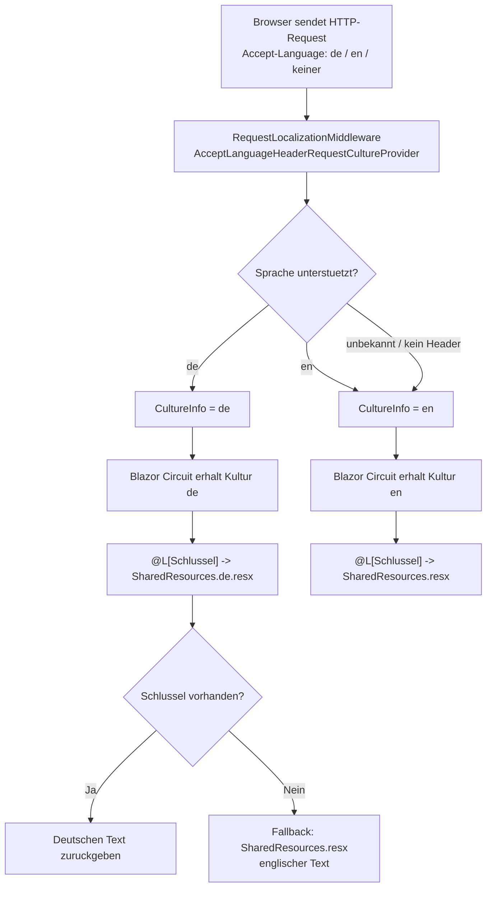

# Mehrsprachigkeit DE/EN — Technischer Ablauf

## Ubersicht

Wenn ein Browser eine Seite aufruft, liest ASP.NET Core den `Accept-Language`-Header aus und setzt
die Kultur fur den Request-Thread. Alle Razor-Komponenten rufen `IStringLocalizer<SharedResources>`
auf, der die Texte aus der passenden `.resx`-Datei ladt. Bei Blazor Server ubernimmt der
SignalR-Circuit die Kultur des initialen HTTP-Requests fur die gesamte Sitzung.

## Ablauf

### 1. Request trifft ein

Der Browser sendet einen HTTP-Request mit dem Header `Accept-Language` (z. B. `de`, `en-US`,
oder keinem Header).

Beteiligte Komponenten:
- HTTP-Request-Pipeline in `Program.BuildWebApplicationAsync`

### 2. Lokalisierungs-Middleware wertet den Header aus

`UseRequestLocalization()` aktiviert den `AcceptLanguageHeaderRequestCultureProvider`. Dieser
Provider vergleicht die Sprachpraferenzen im Header mit den unterstutzten Kulturen (`"en"`, `"de"`).

Beteiligte Komponenten:
- `RequestLocalizationOptions` (konfiguriert in `Program.BuildWebApplicationAsync`)
- `AcceptLanguageHeaderRequestCultureProvider` (standardm. aktiv, keine explizite Registrierung ntig)
- `RequestLocalizationMiddleware`

Resultat:
- Passt die Sprache zu `"de"`: `CultureInfo.CurrentCulture` und `CultureInfo.CurrentUICulture`
  werden auf `de` gesetzt.
- Passt keine Sprache oder kein Header: Fallback auf `"en"` (Default-Kultur).

### 3. Blazor Server ubernimmt die Kultur in den Circuit

Beim initialen SSR-Rendering ubernimmt der Blazor-Server-Circuit die Kultur aus dem HTTP-Request.
Alle Razor-Komponenten teilen sich diese Kultur fur die Dauer der Sitzung.

Beteiligte Komponenten:
- ASP.NET Core 9 Blazor Server Circuit-Infrastruktur

### 4. Razor-Komponenten rufen den Localizer auf

Jede Razor-Komponente hat `@inject IStringLocalizer<SharedResources> L` deklariert und ruft Texte
uber `@L["Schlusselname"]` ab.

Beteiligte Komponenten:
- `IStringLocalizer<SharedResources>` (via DI)
- `SharedResources` (Marker-Klasse in `src/Schnittstellenzentrale/Resources/SharedResources.cs`)
- `SharedResources.resx` (englische Texte / Fallback)
- `SharedResources.de.resx` (deutsche Ubersetzungen)
- `@using Microsoft.Extensions.Localization` (global in `_Imports.razor`)

### 5. Ressourcen-Suche und Fallback

Der Localizer sucht den Schlussel zuerst in der kultur-spezifischen Datei:
- Bei `de`: `SharedResources.de.resx`
- Schlüssel nicht gefunden -> Fallback auf `SharedResources.resx` (englischer Text)
- Schlüssel auch dort nicht gefunden -> Ruckgabe des Schlusselnamens als Rohtext

### 6. DataAnnotations-Validierungsmeldungen

Wenn ein Formular (`EditForm`) mit `DataAnnotations`-Attributen (`[Required]`, `[MaxLength]`,
`[Range]`) validiert wird, leitet `AddDataAnnotationsLocalization()` die Fehlermeldungs-Auflsung
an `SharedResources` weiter. Die Standard-Keys (z. B. `"The field {0} is required."`) sind in
`SharedResources.de.resx` auf deutsch ubersetzt.

Beteiligte Komponenten:
- `AddDataAnnotationsLocalization()` (konfiguriert in `Program.BuildWebApplicationAsync`)
- Contract-Klassen in `src/Schnittstellenzentrale.Core/Contracts/`
- `SharedResources.resx` und `SharedResources.de.resx`
- Razor-Komponenten mit `<EditForm>` und `<ValidationMessage>`

## Diagramm

## Fehlerbehandlung

- Fehlender Schlüssel in `SharedResources.de.resx`: automatischer Fallback auf
  `SharedResources.resx`; kein Fehler, kein Exception.
- Fehlender Schlüssel in `SharedResources.resx`: `IStringLocalizer` gibt den Schlusselname als
  Rohtext zurück und setzt `ResourceNotFound = true`; kein Exception.
- Unterstutzung weiterer Sprachen: nicht konfiguriert; alle nicht-de-Sprachen fallen auf Englisch.
