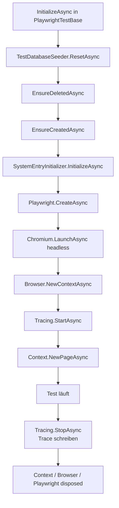

# Playwright-Tests — Technischer Ablauf

## Übersicht

Die Playwright-Tests starten die Anwendung als echten Kestrel-Server über `WebApplicationFactory<Program>`, setzen vor jedem Test die Datenbank zurück und steuern dann einen headless Chromium-Browser über die Playwright .NET-API. Die Infrastruktur gliedert sich in vier Klassen: `PlaywrightTestFactory`, `PlaywrightSignalRFactory`, `PlaywrightTestBase` und `TestDatabaseSeeder`.

---

## Ablauf: Testserver-Start (einmalig pro Collection)

xUnit instanziiert `PlaywrightTestFactory` einmalig als `ICollectionFixture<PlaywrightTestFactory>` beim Start der Collection `"Playwright"`.

### 1. `ConfigureWebHost`

`PlaywrightTestFactory.ConfigureWebHost` konfiguriert den Kestrel-Server:

- `builder.UseEnvironment("Testing")` — setzt die ASP.NET-Umgebung.
- `builder.UseUrls("http://127.0.0.1:0")` — bindet Kestrel auf einem zufälligen freien Port.
- `ConfigureAppConfiguration` trägt `ConnectionStrings:Default = Data Source=schnittstellenzentrale-tests.db` und `DatabaseProvider = SQLite` in die Konfiguration ein.
- `ConfigureTestServices` — ruft die überschreibbare Methode `ConfigureTestServices(IServiceCollection)` auf.

### 2. `ConfigureTestServices`

Beteiligte Komponenten: `TestAuthHandler`, `AppDbContext`, `ISignalRNotificationService`, `ICurrentUserService`

- Entfernt alle vorhandenen Authentication-Registrierungen (`IAuthenticationSchemeProvider`, `IAuthenticationHandlerProvider`, `IConfigureOptions<AuthenticationOptions>`).
- Registriert `TestAuthHandler` als einziges Auth-Schema `"Test"`.
- Ersetzt `IDbContextFactory<AppDbContext>` durch eine SQLite-Datei-Verbindung auf `schnittstellenzentrale-tests.db`.
- Entfernt alle `IHostedService`-Registrierungen (z. B. `SystemEndpointSyncService`), damit Hintergrunddienste während der Tests nicht laufen.
- Ersetzt `ISignalRNotificationService` durch ein `Moq`-Mock-Objekt.
- Ersetzt `ICurrentUserService` durch ein `Moq`-Mock-Objekt, das konstant `TEST\testuser` zurückgibt.

### 3. `CreateHost`

Nach `base.CreateHost(builder)`:

- Liest die tatsächliche Kestrel-Adresse aus `IServerAddressesFeature.Addresses` und schreibt sie in die `BaseAddress`-Property.
- Trägt `Api:BaseUrl = BaseAddress` in die laufende Konfiguration ein, damit `SystemEntryInitializer` die korrekte URL für die Systemanwendung verwendet.
- Ruft `db.Database.EnsureCreated()` auf, um das Datenbankschema initial anzulegen.
- Ruft `SystemEntryInitializer.InitializeAsync` auf, um die Systemgruppe und -anwendung „Schnittstellenzentrale" anzulegen.

---

## Ablauf: Test-Setup und Teardown (pro Testklasse)

`PlaywrightTestBase` implementiert `IAsyncLifetime`. Die meisten Testklassen erben von `PlaywrightTestBase`; `SignalRSyncTests` implementiert `IAsyncLifetime` direkt.

### 1. `InitializeAsync`

Beteiligte Komponenten: `TestDatabaseSeeder`, `IPlaywright`, `IBrowser`, `IBrowserContext`, `IPage`

1. `TestDatabaseSeeder.ResetAsync` wird aufgerufen (Datenbank löschen und neu anlegen, siehe unten).
2. `_factory.BaseAddress` wird in `BaseUrl` gespeichert.
3. `Microsoft.Playwright.Playwright.CreateAsync()` erzeugt eine `IPlaywright`-Instanz.
4. `_playwright.Chromium.LaunchAsync(new BrowserTypeLaunchOptions { Headless = true })` startet Chromium.
5. `_browser.NewContextAsync()` erzeugt einen `IBrowserContext`.
6. `Context.Tracing.StartAsync(new TracingStartOptions { Screenshots = true, Snapshots = true, Sources = true })` aktiviert die Aufzeichnung.
7. `Context.NewPageAsync()` erzeugt die `IPage`-Instanz, die dem Test als `Page`-Property zur Verfügung steht.

### 2. Testmethode

Der Test navigiert via `Page.GotoAsync(BaseUrl)` zur Startseite und interagiert mit der UI.

### 3. `DisposeAsync`

1. `Directory.CreateDirectory("playwright-traces")` stellt sicher, dass das Ausgabeverzeichnis existiert.
2. `Context.Tracing.StopAsync(new TracingStopOptions { Path = "playwright-traces/{TestName}.zip" })` schreibt die Trace-Datei.
3. `Context.DisposeAsync()`, `_browser.DisposeAsync()`, `_playwright.Dispose()` geben alle Playwright-Ressourcen frei.

---

## Ablauf: Datenbankrücksetzung (`TestDatabaseSeeder.ResetAsync`)

Beteiligte Komponenten: `TestDatabaseSeeder`, `IDbContextFactory<AppDbContext>`, `AppDbContext`, `SystemEntryInitializer`

1. Ein neuer DI-Scope wird über `_services.CreateScope()` erzeugt.
2. `IDbContextFactory<AppDbContext>.CreateDbContext()` erzeugt einen `AppDbContext`.
3. `db.Database.EnsureDeletedAsync()` löscht die SQLite-Datei vollständig.
4. `db.Database.EnsureCreatedAsync()` legt das Schema neu an.
5. `SystemEntryInitializer.InitializeAsync(_services, _configuration)` legt die Systemgruppe und -anwendung neu an.

---

## Ablauf: SignalR-Echtzeitsynchronisation (`SignalRSyncTests`)

Beteiligte Komponenten: `SignalRSyncTests`, `PlaywrightSignalRFactory`, `EndpointHub`, `SignalRNotificationService<EndpointHub>`

`PlaywrightSignalRFactory` erbt von `PlaywrightTestFactory` und überschreibt `ConfigureTestServices`:

- Ruft `base.ConfigureTestServices(services)` auf (alle Standard-Overrides inklusive SignalR-Mock).
- Entfernt dann den `ISignalRNotificationService`-Mock wieder.
- Registriert `SignalRNotificationService<EndpointHub>` als echte Implementierung.

`SignalRSyncTests` implementiert `IAsyncLifetime` direkt (kein `PlaywrightTestBase`) und erzeugt zwei Browser-Kontexte:

1. `_contextA = await _browser.NewContextAsync()` — Browser A.
2. `_contextB = await _browser.NewContextAsync()` — Browser B.
3. Beide navigieren zur Startseite und wechseln per `Locator(".top-row select").SelectOptionAsync("Team")` in den Team-Modus.
4. Browser A legt über das UI eine neue Anwendung an (Button „Neue Anwendung", Felder „Name" und „Basis-URL", Button „Speichern").
5. `Assertions.Expect(_pageB.GetByText("SignalR-Sync-Test")).ToBeVisibleAsync()` wartet, bis der neue Eintrag in Browser B erscheint — ohne `Page.ReloadAsync`.

Beide Kontexte schreiben separate Trace-Dateien: `SignalRSyncTests-A.zip` und `SignalRSyncTests-B.zip`.

---

## Klassenübersicht

| Klasse | Namespace | Zweck |
|---|---|---|
| `PlaywrightTestFactory` | `Schnittstellenzentrale.Tests.Playwright.Infrastructure` | Kestrel-Testserver mit Auth-Bypass, Datei-SQLite, gemockten Services |
| `PlaywrightSignalRFactory` | `Schnittstellenzentrale.Tests.Playwright.Infrastructure` | Erbt von `PlaywrightTestFactory`; aktiviert echten SignalR-Stack |
| `PlaywrightTestBase` | `Schnittstellenzentrale.Tests.Playwright.Infrastructure` | Basisklasse; verwaltet Playwright-Lebenszyklus und Tracing |
| `TestDatabaseSeeder` | `Schnittstellenzentrale.Tests.Playwright.Infrastructure` | Löscht und re-erstellt `schnittstellenzentrale-tests.db` |
| `PlaywrightCollection` | `Schnittstellenzentrale.Tests.Playwright.Infrastructure` | `[CollectionDefinition("Playwright")]` mit `ICollectionFixture<PlaywrightTestFactory>` |
| `PlaywrightSignalRCollection` | `Schnittstellenzentrale.Tests.Playwright.Infrastructure` | `[CollectionDefinition("PlaywrightSignalR")]` mit `ICollectionFixture<PlaywrightSignalRFactory>` |
| `HomePageTests` | `Schnittstellenzentrale.Tests.Playwright` | Ablauf 1: Startseite und Systemeinträge |
| `ApplicationCrudTests` | `Schnittstellenzentrale.Tests.Playwright` | Ablauf 2: Anwendung anlegen, bearbeiten, löschen |
| `EndpointExecutionTests` | `Schnittstellenzentrale.Tests.Playwright` | Ablauf 3: Endpunkt ausführen |
| `SwaggerImportTests` | `Schnittstellenzentrale.Tests.Playwright` | Ablauf 4: Swagger-Import |
| `HealthCheckTests` | `Schnittstellenzentrale.Tests.Playwright` | Ablauf 5: Health-Check |
| `StorageModeTests` | `Schnittstellenzentrale.Tests.Playwright` | Ablauf 6: Speichermodus wechseln |
| `SignalRSyncTests` | `Schnittstellenzentrale.Tests.Playwright` | Ablauf 7: SignalR-Echtzeitsynchronisation |

---

## Fehlerbehandlung

- Schlägt ein Test fehl, enthält die Trace-Datei unter `playwright-traces/{TestName}.zip` Screenshots, DOM-Snapshots und Quelltexte zum Zeitpunkt des Fehlers.
- Bei `SignalRSyncTests` gibt es zwei Trace-Dateien: `SignalRSyncTests-A.zip` (Browser A) und `SignalRSyncTests-B.zip` (Browser B).
- Playwright-Assertions (`Assertions.Expect(...)`) warten standardmäßig bis zu 30 Sekunden auf das Erscheinen eines Elements, bevor sie fehlschlagen. Dieser Timeout greift auch bei SignalR-Updates in Browser B.
