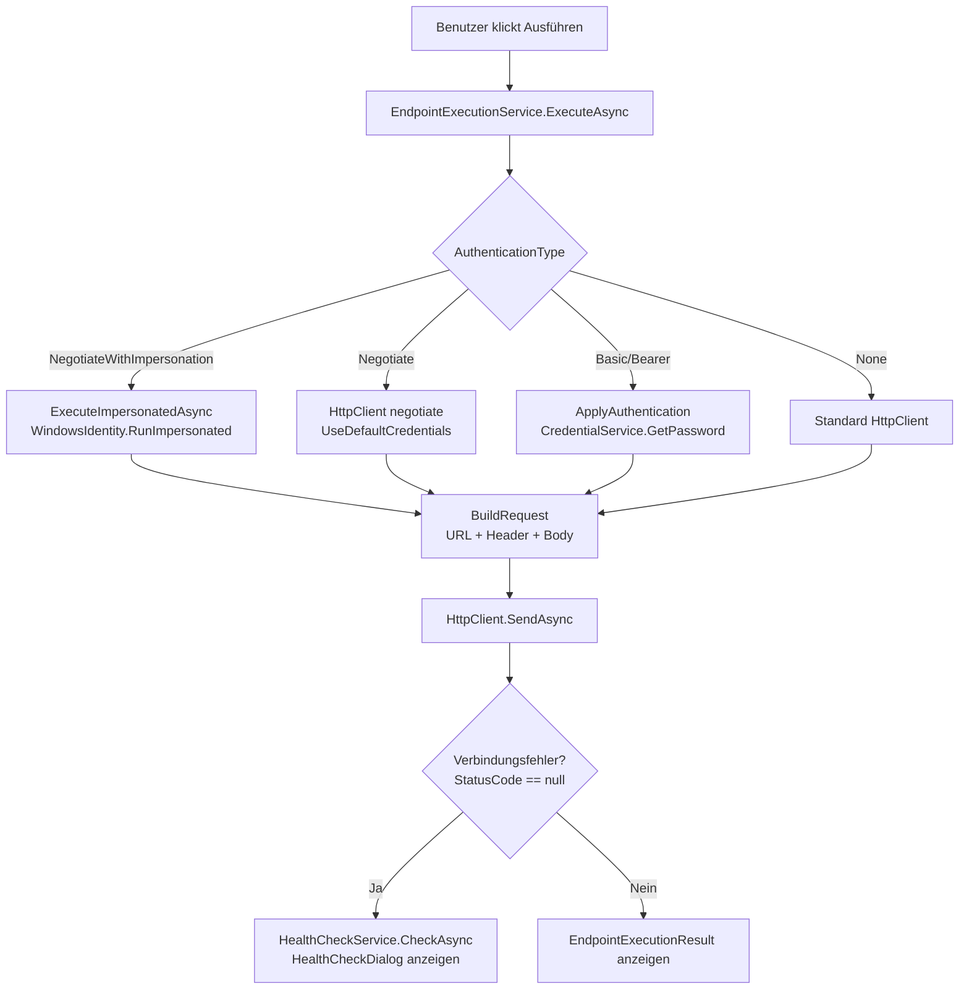

# Schnittstellenzentrale — Technischer Ablauf

## Übersicht

Die Anwendung folgt einem klassischen Blazor-Server-Muster: UI-Komponenten rufen Services über Dependency Injection auf, Services kommunizieren mit der Datenbankschicht über Repositories und mit externen Systemen über `IHttpClientFactory`. Schreiboperationen im Team-Modus lösen anschließend SignalR-Broadcasts aus. Der Ablauf gliedert sich in vier Hauptbereiche: Anwendungsstart, Datenzugriff, Endpunktausführung und Import.

---

## Ablauf: Anwendungsstart

### 1. Konfiguration lesen und Dienste registrieren

`Program.cs` liest `appsettings.json` und registriert alle Dienste in der DI:

- `DatabaseProviderFactory.RegisterDbContext` wertet `DatabaseProvider` aus und registriert `AppDbContext` mit SQLite oder SQL Server.
- Windows-Authentifizierung wird über `AddNegotiate()` konfiguriert.
- Alle Services werden als Scoped (`IApplicationRepository`, `IEndpointRepository`, `IStorageModeService`, `IEndpointExecutionService`, `ISwaggerImportService`, `IODataImportService`, `ISignalRNotificationService`) oder Singleton (`IHealthCheckService`, `ICredentialService`, `ICurrentUserService`) registriert.
- `EndpointHub` wird unter `/hubs/endpoint` gemappt.
- Serilog wird als Logging-Provider mit EventLog- und Datei-Sink konfiguriert.

---

## Ablauf: Datenzugriff (StorageMode)

### 1. Modus bestimmen

`StorageModeService` (Scoped, pro Blazor-Circuit) hält den aktiven `StorageMode` (`Team` oder `User`). Standardwert: `Team`.

Beteiligte Komponenten:
- `StorageModeService.CurrentMode` — aktueller Modus der Sitzung
- `StorageModeService.SetMode` — ändert den Modus und feuert `OnModeChanged`

### 2. Benutzernamen ermitteln

`WindowsCurrentUserService.GetCurrentUserName()` liefert den Windows-Benutzernamen über `WindowsIdentity.GetCurrent().Name`.

### 3. Datenbankabfrage (storageMode-bewusst)

`ApplicationRepository.GetGroupsAsync` und `GetUngroupedApplicationsAsync` filtern bei `StorageMode.User` zusätzlich nach `Application.Owner == owner`. Im `Team`-Modus werden alle Datensätze zurückgegeben.

Beteiligte Komponenten:
- `ApplicationRepository.GetGroupsAsync(StorageMode, string owner)` — Gruppen mit zugehörigen Anwendungen
- `ApplicationRepository.GetUngroupedApplicationsAsync(StorageMode, string owner)` — Anwendungen ohne Gruppe
- `AppDbContext.Applications`, `AppDbContext.ApplicationGroups` — EF-Core-DbSets

### 4. UI-Aktualisierung bei Moduswechsel

Alle Komponenten, die `IStorageModeService.OnModeChanged` abonniert haben (`ApplicationGroupTree`, `MainLayout`), rufen `LoadDataAsync` erneut auf und lösen `StateHasChanged` aus.

---

## Ablauf: Endpunktausführung

### 1. Benutzer klickt „Ausführen"

`EndpointExecutionPanel.ExecuteAsync()` ruft `IEndpointExecutionService.ExecuteAsync(endpoint)` auf.

### 2. Authentifizierungsstrategie wählen

`EndpointExecutionService.ExecuteAsync` verzweigt nach `endpoint.AuthenticationType`:

- `NegotiateWithImpersonation` → `ExecuteImpersonatedAsync` (nutzt `WindowsIdentity.RunImpersonated`)
- `Negotiate` → Named HttpClient `"negotiate"` (mit `UseDefaultCredentials = true`)
- Alle anderen → Standard-HttpClient

### 3. Request aufbauen

`BuildRequest` baut die vollständige URL aus `BaseUrl` + `RelativePath` + URL-kodierten Query-Parametern. Header werden per `TryAddWithoutValidation` gesetzt. Body wird als `StringContent` mit `Content-Type` aus den Headern (Fallback: `application/json`) gesetzt.

### 4. Authentifizierung anwenden

`ApplyAuthentication` liest Credentials für Basic und BearerToken aus dem Windows Credential Manager (Schlüssel: `Schnittstellenzentrale:{ApplicationId}:{AuthenticationType}`) und setzt den `Authorization`-Header.

Beteiligte Komponenten:
- `WindowsCredentialService.GetPassword(target)` — liest Passwort/Token via DPAPI

### 5. Request senden und Ergebnis aufbereiten

`BuildResult` liest Response-Body und erstellt `EndpointExecutionResult` mit `Success`, `StatusCode`, `RequestDetails` und `ResponseBody`.

### 6. Verbindungsfehler → Health-Check

Wenn `_result.Success == false && _result.StatusCode == null` (kein HTTP-Status → Verbindungsfehler), ruft `EndpointExecutionPanel` `IHealthCheckService.CheckAsync(application)` auf und zeigt `HealthCheckDialog`.

## Fehlerbehandlung

- `EndpointExecutionService` fängt alle Ausnahmen und gibt `EndpointExecutionResult.ErrorMessage` zurück; kein unkontrolliertes Weiterwerfen.
- `HealthCheckService` fängt `HttpRequestException`, `TaskCanceledException` und allgemeine Ausnahmen; loggt sie als Warning und gibt `false` zurück.
- `EndpointEditor` fängt `DbUpdateConcurrencyException` und zeigt `ConcurrencyWarningDialog` an.

---

## Ablauf: Swagger- und OData-Import

### 1. Benutzer klickt „Swagger-Import" oder „OData-Import"

`ApplicationCard` ruft `SwaggerImportService.ImportAsync(application)` bzw. `ODataImportService.ImportAsync(application)` auf.

### 2. Definition abrufen

Der Service lädt die Definition über `IHttpClientFactory` (HTTP GET auf `SwaggerUrl` bzw. `MetadataUrl`).

### 3. Definition parsen

- `SwaggerImportService`: Deserialisiert OpenAPI-Dokument via `OpenApiStreamReader` (Microsoft.OpenApi). Iteriert über `document.Paths` und deren `Operations`.
- `ODataImportService`: Parst XML via `CsdlReader.Parse` (Microsoft.OData.Edm). Erzeugt Endpunkte für `EntitySets` (GET + POST) und `IEdmOperation`-Elemente (Actions → POST, Functions → GET).

### 4. Diff berechnen

`ImportDiffCalculator.Calculate(existingEndpoints, importedEndpoints)` vergleicht bestehende und importierte Endpunkte anhand des Schlüssels `{Method}:{RelativePath}`:
- Nur in importiert → `NewEndpoints`
- In beiden, Name unterschiedlich → `ChangedEndpoints`
- Nur in bestehend → `RemovedEndpoints`

### 5. Diff-Vorschau anzeigen

`ImportDialog` zeigt neue (grün), geänderte (gelb) und entfernte (rot) Endpunkte mit Checkboxen. Alle Einträge sind standardmäßig ausgewählt.

### 6. Übernehmen

`ImportDialog.ApplyAsync` ruft für ausgewählte neue Endpunkte `AddEndpointAsync`, für geänderte `UpdateEndpointAsync` und für entfernte `DeleteEndpointAsync` auf.

---

## Ablauf: SignalR-Benachrichtigung (Team-Modus)

### 1. Schreiboperation auslösen

Nach einer Schreiboperation im Team-Modus ruft die UI-Komponente `ISignalRNotificationService.NotifyApplicationChangedAsync(applicationId)` oder `NotifyGroupChangedAsync(groupId)` auf.

Beteiligte Komponenten:
- `SignalRNotificationService<EndpointHub>.NotifyApplicationChangedAsync` — sendet `"ApplicationChanged"` an Gruppe `"application:{id}"`
- `SignalRNotificationService<EndpointHub>.NotifyGroupChangedAsync` — sendet `"GroupChanged"` an Gruppe `"group:{id}"`

### 2. Hub-Abonnement

`EndpointHub` verwaltet Gruppen-Mitgliedschaften:
- `SubscribeToApplication(int applicationId)` → `Groups.AddToGroupAsync("application:{id}")`
- `SubscribeToGroup(int groupId)` → `Groups.AddToGroupAsync("group:{id}")`
