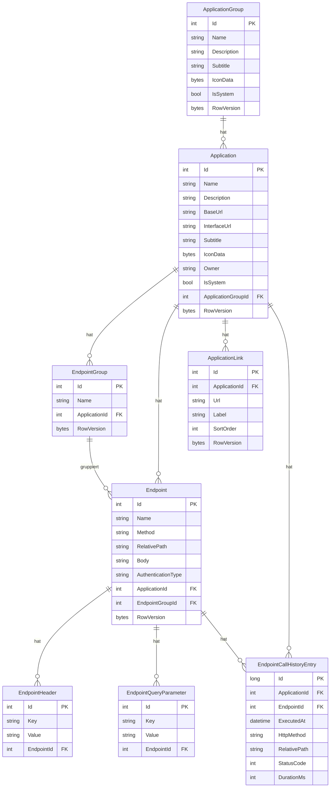

# Schnittstellenzentrale — Datenmodell

## Entitäten

### `ApplicationGroup`

Optionale Sammlung zur Organisation von Anwendungen.

| Eigenschaft | Typ | Beschreibung |
|-------------|-----|--------------|
| `Id` | `int` | Primärschlüssel |
| `Name` | `string` (max. 200) | Name der Sammlung |
| `Description` | `string?` | Optionale Beschreibung |
| `Subtitle` | `string?` | Optionaler Untertitel (In-place-Editing) |
| `IconData` | `byte[]?` | Icon-Bytes (PNG oder JPEG, max. 512 KB) |
| `IsSystem` | `bool` | `true` für die Systemgruppe „Schnittstellenzentrale" |
| `RowVersion` | `byte[]` | Concurrency-Token (Optimistic Concurrency) |
| `Applications` | `ICollection<Application>` | Zugehörige Anwendungen |

### `Application`

Eine Webservice-Anwendung mit einer Basis-URL.

| Eigenschaft | Typ | Beschreibung |
|-------------|-----|--------------|
| `Id` | `int` | Primärschlüssel |
| `Name` | `string` (max. 200) | Name der Anwendung |
| `Description` | `string` | Freitext-Beschreibung |
| `BaseUrl` | `string` (max. 500) | Basis-URL der Anwendung |
| `InterfaceUrl` | `string?` | URL der Swagger/OpenAPI- oder OData-`$metadata`-Definition (optional) |
| `InterfaceType` | `InterfaceType` | Erkannter Schnittstellentyp (`Unknown`, `Rest`, `OData`) |
| `Subtitle` | `string?` | Optionaler Untertitel (In-place-Editing) |
| `IconData` | `byte[]?` | Icon-Bytes (PNG oder JPEG, max. 512 KB) |
| `Owner` | `string?` (max. 256) | Windows-Benutzername des Eigentümers (für Benutzermodus) |
| `IsSystem` | `bool` | `true` für die Systemanwendung „Schnittstellenzentrale" |
| `ApplicationGroupId` | `int?` | Fremdschlüssel auf `ApplicationGroup` (optional) |
| `ApplicationGroup` | `ApplicationGroup?` | Navigationseigenschaft |
| `RowVersion` | `byte[]` | Concurrency-Token |
| `Endpoints` | `ICollection<Endpoint>` | Endpunkte der Anwendung |
| `EndpointGroups` | `ICollection<EndpointGroup>` | Endpunktgruppen der Anwendung |
| `Links` | `ICollection<ApplicationLink>` | Verknüpfte URL-Links der Anwendung |

### `EndpointGroup`

Untergruppe innerhalb einer Anwendung zur Organisation von Endpunkten.

| Eigenschaft | Typ | Beschreibung |
|-------------|-----|--------------|
| `Id` | `int` | Primärschlüssel |
| `Name` | `string` (max. 200) | Name der Gruppe |
| `ApplicationId` | `int` | Fremdschlüssel auf `Application` |
| `Application` | `Application` | Navigationseigenschaft |
| `RowVersion` | `byte[]` | Concurrency-Token |
| `Endpoints` | `ICollection<Endpoint>` | Endpunkte dieser Gruppe |

### `Endpoint`

Ein HTTP-Endpunkt einer Anwendung.

| Eigenschaft | Typ | Beschreibung |
|-------------|-----|--------------|
| `Id` | `int` | Primärschlüssel |
| `Name` | `string` (max. 200) | Bezeichnung des Endpunkts |
| `Method` | `HttpMethod` | HTTP-Methode (GET, POST, PUT, DELETE, PATCH, HEAD, OPTIONS) |
| `RelativePath` | `string` (max. 500) | Pfad relativ zur Basis-URL |
| `Body` | `string?` | Request-Body (z. B. JSON) |
| `AuthenticationType` | `AuthenticationType` | Authentifizierungstyp |
| `ApplicationId` | `int` | Fremdschlüssel auf `Application` |
| `Application` | `Application` | Navigationseigenschaft |
| `EndpointGroupId` | `int?` | Fremdschlüssel auf `EndpointGroup` (optional) |
| `EndpointGroup` | `EndpointGroup?` | Navigationseigenschaft |
| `RowVersion` | `byte[]` | Concurrency-Token |
| `Headers` | `ICollection<EndpointHeader>` | HTTP-Header des Endpunkts |
| `QueryParameters` | `ICollection<EndpointQueryParameter>` | Query-Parameter des Endpunkts |

### `EndpointHeader`

Ein HTTP-Header-Schlüssel-Wert-Paar für einen Endpunkt.

| Eigenschaft | Typ | Beschreibung |
|-------------|-----|--------------|
| `Id` | `int` | Primärschlüssel |
| `Key` | `string` (max. 200) | Header-Name |
| `Value` | `string` (max. 2000) | Header-Wert |
| `EndpointId` | `int` | Fremdschlüssel auf `Endpoint` |
| `Endpoint` | `Endpoint` | Navigationseigenschaft |

### `EndpointQueryParameter`

Ein Query-Parameter-Schlüssel-Wert-Paar für einen Endpunkt.

| Eigenschaft | Typ | Beschreibung |
|-------------|-----|--------------|
| `Id` | `int` | Primärschlüssel |
| `Key` | `string` (max. 200) | Parameter-Name |
| `Value` | `string` (max. 2000) | Parameter-Wert |
| `EndpointId` | `int` | Fremdschlüssel auf `Endpoint` |
| `Endpoint` | `Endpoint` | Navigationseigenschaft |

### `ApplicationLink`

Ein URL-Link mit optionaler Beschriftung, der einer Anwendung zugeordnet ist.

| Eigenschaft | Typ | Beschreibung |
|-------------|-----|--------------|
| `Id` | `int` | Primärschlüssel |
| `ApplicationId` | `int` | Fremdschlüssel auf `Application` |
| `Application` | `Application` | Navigationseigenschaft |
| `Url` | `string?` | URL des Links (Pflichtfeld bei Eingabe: muss mit `http://` oder `https://` beginnen) |
| `Label` | `string?` | Optionale Beschriftung (max. 200 Zeichen) |
| `SortOrder` | `int?` | Sortierreihenfolge |
| `RowVersion` | `byte[]` | Concurrency-Token |

### `EndpointCallHistoryEntry`

Ein persistierter Datensatz über einen abgeschlossenen Endpunktaufruf.

| Eigenschaft | Typ | Beschreibung |
|-------------|-----|--------------|
| `Id` | `long` | Primärschlüssel |
| `ApplicationId` | `int?` | Fremdschlüssel auf `Application` (nullable) |
| `Application` | `Application?` | Navigationseigenschaft |
| `EndpointId` | `int?` | Fremdschlüssel auf `Endpoint` (nullable) |
| `Endpoint` | `Endpoint?` | Navigationseigenschaft |
| `ExecutedAt` | `DateTime?` | Zeitpunkt der Ausführung (UTC) |
| `HttpMethod` | `string?` | HTTP-Methode (z. B. `GET`, `POST`) |
| `RelativePath` | `string?` | Relativer Pfad des aufgerufenen Endpunkts |
| `StatusCode` | `int?` | HTTP-Statuscode der Antwort |
| `DurationMs` | `int?` | Antwortzeit in Millisekunden |

---

### `NavigationArea`

Enum für die drei Anwendungsbereiche der TopBar-Navigation.

| Wert | Beschreibung |
|------|--------------|
| `Workspaces` | Bereich für Sammlungen, Anwendungen und Endpunkte |
| `Environments` | Bereich für Systemumgebungen |
| `History` | Bereich für die persistente Aufrufhistorie |

---

## Enums

### `StorageMode`

| Wert | Beschreibung |
|------|--------------|
| `Team` | Globaler Speicherbereich, für alle Benutzer sichtbar |
| `User` | Benutzerspezifischer Speicherbereich, gefiltert nach `Owner` |

### `HttpMethod`

`GET`, `POST`, `PUT`, `DELETE`, `PATCH`, `HEAD`, `OPTIONS`

### `AuthenticationType`

| Wert | Beschreibung |
|------|--------------|
| `None` | Keine Authentifizierung |
| `Basic` | HTTP Basic Auth (Credentials aus Windows Credential Manager) |
| `Negotiate` | Windows-Negotiate (Kerberos/NTLM, UseDefaultCredentials) |
| `BearerToken` | Bearer-Token (Token aus Windows Credential Manager) |
| `NegotiateWithImpersonation` | Negotiate mit `WindowsIdentity.RunImpersonated` |

---

## Beziehungen

- `ApplicationGroup` 1 — 0..* `Application` (bei Löschung der Gruppe: `ApplicationGroupId` wird `NULL`)
- `Application` 1 — 0..* `Endpoint` (Cascade-Löschung)
- `Application` 1 — 0..* `EndpointGroup` (Cascade-Löschung)
- `Application` 1 — 0..* `ApplicationLink` (Cascade-Löschung)
- `Application` 0..* — 0..* `EndpointCallHistoryEntry` (FK nullable, kein Cascade)
- `EndpointGroup` 1 — 0..* `Endpoint` (bei Löschung der Gruppe: `EndpointGroupId` wird `NULL`)
- `Endpoint` 1 — 0..* `EndpointHeader` (Cascade-Löschung)
- `Endpoint` 1 — 0..* `EndpointQueryParameter` (Cascade-Löschung)
- `Endpoint` 0..* — 0..* `EndpointCallHistoryEntry` (FK nullable, kein Cascade)

## Diagramm

