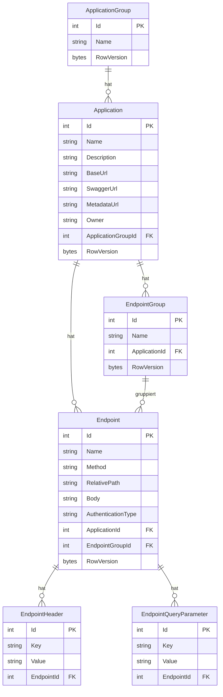

# Schnittstellenzentrale — Datenmodell

## Entitäten

### `ApplicationGroup`

Optionale Gruppe zur Organisation von Anwendungen.

| Eigenschaft | Typ | Beschreibung |
|-------------|-----|--------------|
| `Id` | `int` | Primärschlüssel |
| `Name` | `string` (max. 200) | Name der Gruppe |
| `RowVersion` | `byte[]` | Concurrency-Token (Optimistic Concurrency) |
| `Applications` | `ICollection<Application>` | Zugehörige Anwendungen |

### `Application`

Eine Webservice-Anwendung mit einer Basis-URL.

| Eigenschaft | Typ | Beschreibung |
|-------------|-----|--------------|
| `Id` | `int` | Primärschlüssel |
| `Name` | `string` (max. 200) | Name der Anwendung |
| `Description` | `string` | Freitext-Beschreibung |
| `BaseUrl` | `string` (max. 500) | Basis-URL der Anwendung |
| `SwaggerUrl` | `string?` (max. 500) | URL der Swagger/OpenAPI-Definition (optional) |
| `MetadataUrl` | `string?` (max. 500) | URL der OData-`$metadata` (optional) |
| `Owner` | `string?` (max. 256) | Windows-Benutzername des Eigentümers (für Benutzermodus) |
| `ApplicationGroupId` | `int?` | Fremdschlüssel auf `ApplicationGroup` (optional) |
| `ApplicationGroup` | `ApplicationGroup?` | Navigationseigenschaft |
| `RowVersion` | `byte[]` | Concurrency-Token |
| `Endpoints` | `ICollection<Endpoint>` | Endpunkte der Anwendung |
| `EndpointGroups` | `ICollection<EndpointGroup>` | Endpunktgruppen der Anwendung |

### `EndpointGroup`

Untergruppe innerhalb einer Anwendung zur Organisation von Endpunkten.

| Eigenschaft | Typ | Beschreibung |
|-------------|-----|--------------|
| `Id` | `int` | Primärschlüssel |
| `Name` | `string` (max. 200) | Name der Gruppe |
| `ApplicationId` | `int` | Fremdschlüssel auf `Application` |
| `Application` | `Application` | Navigationseigenschaft |
| `RowVersion` | `byte[]` | Concurrency-Token |
| `Endpoints` | `ICollection<Endpoint>` | Endpunkte dieser Gruppe |

### `Endpoint`

Ein HTTP-Endpunkt einer Anwendung.

| Eigenschaft | Typ | Beschreibung |
|-------------|-----|--------------|
| `Id` | `int` | Primärschlüssel |
| `Name` | `string` (max. 200) | Bezeichnung des Endpunkts |
| `Method` | `HttpMethod` | HTTP-Methode (GET, POST, PUT, DELETE, PATCH, HEAD, OPTIONS) |
| `RelativePath` | `string` (max. 500) | Pfad relativ zur Basis-URL |
| `Body` | `string?` | Request-Body (z. B. JSON) |
| `AuthenticationType` | `AuthenticationType` | Authentifizierungstyp |
| `ApplicationId` | `int` | Fremdschlüssel auf `Application` |
| `Application` | `Application` | Navigationseigenschaft |
| `EndpointGroupId` | `int?` | Fremdschlüssel auf `EndpointGroup` (optional) |
| `EndpointGroup` | `EndpointGroup?` | Navigationseigenschaft |
| `RowVersion` | `byte[]` | Concurrency-Token |
| `Headers` | `ICollection<EndpointHeader>` | HTTP-Header des Endpunkts |
| `QueryParameters` | `ICollection<EndpointQueryParameter>` | Query-Parameter des Endpunkts |

### `EndpointHeader`

Ein HTTP-Header-Schlüssel-Wert-Paar für einen Endpunkt.

| Eigenschaft | Typ | Beschreibung |
|-------------|-----|--------------|
| `Id` | `int` | Primärschlüssel |
| `Key` | `string` (max. 200) | Header-Name |
| `Value` | `string` (max. 2000) | Header-Wert |
| `EndpointId` | `int` | Fremdschlüssel auf `Endpoint` |
| `Endpoint` | `Endpoint` | Navigationseigenschaft |

### `EndpointQueryParameter`

Ein Query-Parameter-Schlüssel-Wert-Paar für einen Endpunkt.

| Eigenschaft | Typ | Beschreibung |
|-------------|-----|--------------|
| `Id` | `int` | Primärschlüssel |
| `Key` | `string` (max. 200) | Parameter-Name |
| `Value` | `string` (max. 2000) | Parameter-Wert |
| `EndpointId` | `int` | Fremdschlüssel auf `Endpoint` |
| `Endpoint` | `Endpoint` | Navigationseigenschaft |

---

## Enums

### `StorageMode`

| Wert | Beschreibung |
|------|--------------|
| `Team` | Globaler Speicherbereich, für alle Benutzer sichtbar |
| `User` | Benutzerspezifischer Speicherbereich, gefiltert nach `Owner` |

### `HttpMethod`

`GET`, `POST`, `PUT`, `DELETE`, `PATCH`, `HEAD`, `OPTIONS`

### `AuthenticationType`

| Wert | Beschreibung |
|------|--------------|
| `None` | Keine Authentifizierung |
| `Basic` | HTTP Basic Auth (Credentials aus Windows Credential Manager) |
| `Negotiate` | Windows-Negotiate (Kerberos/NTLM, UseDefaultCredentials) |
| `BearerToken` | Bearer-Token (Token aus Windows Credential Manager) |
| `NegotiateWithImpersonation` | Negotiate mit `WindowsIdentity.RunImpersonated` |

---

## Beziehungen

- `ApplicationGroup` 1 — 0..* `Application` (bei Löschung der Gruppe: `ApplicationGroupId` wird `NULL`)
- `Application` 1 — 0..* `Endpoint` (Cascade-Löschung)
- `Application` 1 — 0..* `EndpointGroup` (Cascade-Löschung)
- `EndpointGroup` 1 — 0..* `Endpoint` (bei Löschung der Gruppe: `EndpointGroupId` wird `NULL`)
- `Endpoint` 1 — 0..* `EndpointHeader` (Cascade-Löschung)
- `Endpoint` 1 — 0..* `EndpointQueryParameter` (Cascade-Löschung)

## Diagramm

