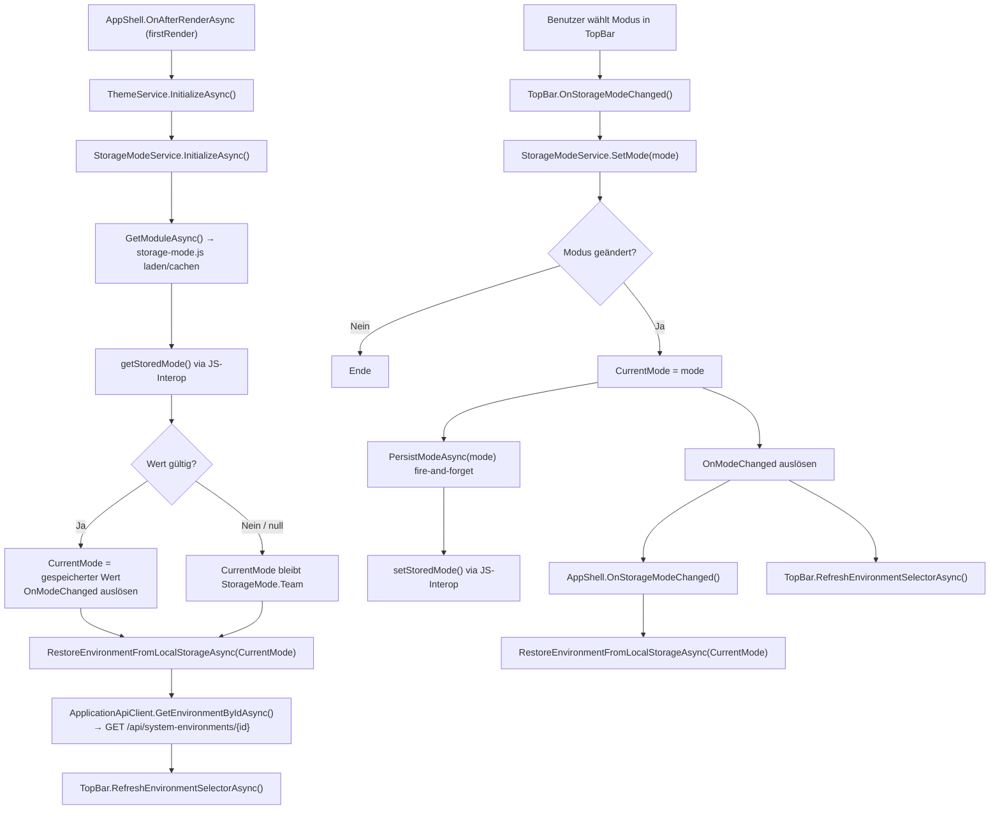

# Speichermodus — Technischer Ablauf

## Übersicht

Das Speichermodus-System besteht aus zwei Abläufen: dem einmaligen Lesen und Wiederherstellen des gespeicherten Modus beim ersten Render (`InitializeAsync`) sowie dem Schreiben bei jeder Modusänderung durch den Benutzer (`SetMode` + `PersistModeAsync`). Beide Abläufe kommunizieren über das JS-Modul `storage-mode.js` mit dem `localStorage` des Browsers.

## Ablauf

### 1. Modus beim Anwendungsstart wiederherstellen

`AppShell.OnAfterRenderAsync(bool firstRender)` wird beim ersten Render aufgerufen:

1. `AppShell` ruft `ThemeService.InitializeAsync()` auf (unverändert; Dark Mode wird zuerst wiederhergestellt).
2. `AppShell` ruft `StorageModeService.InitializeAsync()` auf.
3. `StorageModeService.GetModuleAsync()` importiert `storage-mode.js` lazy per `IJSRuntime.InvokeAsync<IJSObjectReference>("import", "./storage-mode.js")` und cached das Modul-Objekt in `_module`.
4. `StorageModeService.InitializeAsync()` ruft `module.InvokeAsync<string?>("getStoredMode")` auf.
5. Ist der zurückgegebene Wert nicht `null` und ein gültiger `StorageMode`-Enum-Wert (case-insensitive `Enum.TryParse`): `CurrentMode` wird gesetzt und `OnModeChanged` wird ausgelöst, damit `TopBar` den wiederhergestellten Wert sofort anzeigt.
6. Ist der Wert `null` oder ungültig: `CurrentMode` bleibt `StorageMode.Team`; `OnModeChanged` wird nicht ausgelöst.
7. `AppShell` ruft `RestoreEnvironmentFromLocalStorageAsync(StorageModeService.CurrentMode)` auf — nun mit dem bereits wiederhergestellten Modus. Die Umgebung wird über `IApplicationApiClient.GetEnvironmentByIdAsync(id)` geladen (HTTP-Aufruf an `GET /api/system-environments/{id}`).
8. `AppShell` ruft `_topBar.RefreshEnvironmentSelectorAsync()` auf, damit `EnvironmentSelector` die wiederhergestellte Umgebung beim ersten Render korrekt anzeigt.

Beteiligte Komponenten:
- `AppShell.OnAfterRenderAsync` — Steuerung der Initialisierungsreihenfolge
- `StorageModeService.InitializeAsync()` — liest gespeicherten Modus, löst `OnModeChanged` aus
- `StorageModeService.GetModuleAsync()` — lädt und cached `storage-mode.js`
- `storage-mode.js` — Funktion `getStoredMode()`
- `ApplicationApiClient.GetEnvironmentByIdAsync()` — lädt Umgebung via HTTP
- `SystemEnvironmentsController.GetByIdAsync()` — HTTP-Endpunkt `GET /api/system-environments/{id}`
- `TopBar.RefreshEnvironmentSelectorAsync()` — aktualisiert `EnvironmentSelector` nach Restore

---

### 2. Modus beim Wechsel persistieren

Der Benutzer wählt einen neuen Modus im `<select>`-Element der `TopBar`:

1. `TopBar.OnStorageModeChanged(ChangeEventArgs)` parst den neuen Wert mit `Enum.TryParse<StorageMode>`.
2. `TopBar` ruft `StorageModeService.SetMode(mode)` auf.
3. `StorageModeService.SetMode()` prüft: Ist der neue Modus bereits `CurrentMode`? Wenn ja, keine Aktion.
4. `CurrentMode` wird auf den neuen Wert gesetzt.
5. `_ = PersistModeAsync(mode)` wird fire-and-forget gestartet (Interface `SetMode` bleibt `void`).
6. `OnModeChanged` wird ausgelöst.
7. `StorageModeService.PersistModeAsync()` ruft `GetModuleAsync()` auf und ruft `module.InvokeVoidAsync("setStoredMode", mode.ToString())` auf.
8. Fehler vom Typ `JSException` oder `TaskCanceledException` in `PersistModeAsync` werden stillschweigend abgefangen.
9. `AppShell.OnStorageModeChanged()` reagiert auf das `OnModeChanged`-Event und ruft `RestoreEnvironmentFromLocalStorageAsync` mit dem neuen Modus auf.
10. `TopBar` ruft `_environmentSelector.RefreshAsync()` auf, damit der Umgebungsselektor die Daten des neuen Modus anzeigt.

Beteiligte Komponenten:
- `TopBar.OnStorageModeChanged` — Parst Benutzereingabe, ruft `SetMode` auf
- `StorageModeService.SetMode()` — aktualisiert `CurrentMode`, löst Event aus
- `StorageModeService.PersistModeAsync()` — schreibt in `localStorage` fire-and-forget
- `StorageModeService.GetModuleAsync()` — gibt gecachtes Modul zurück
- `storage-mode.js` — Funktion `setStoredMode(value)`
- `AppShell.OnStorageModeChanged()` — reagiert auf Event, restauriert Umgebung

## Diagramm

## Fehlerbehandlung

- `StorageModeService.InitializeAsync()` aktualisiert `CurrentMode` nur, wenn der gespeicherte Wert nicht `null` ist und `Enum.TryParse<StorageMode>` erfolgreich ist. Ungültige oder fehlende Werte werden ignoriert; `StorageMode.Team` bleibt aktiv.
- `StorageModeService.PersistModeAsync()` fängt `JSException` und `TaskCanceledException` ab, da der Browser-Kontext beim Schliessen eines Tabs nicht mehr verfügbar sein kann. Fehler beim Persistieren haben keinen Einfluss auf `CurrentMode` oder den laufenden Zustand.
- `StorageModeService.GetModuleAsync()` verwendet den Null-Koaleszenz-Zuweisungsoperator (`??=`), sodass das JS-Modul auch bei mehrfachen Aufrufen nur einmalig importiert wird.
