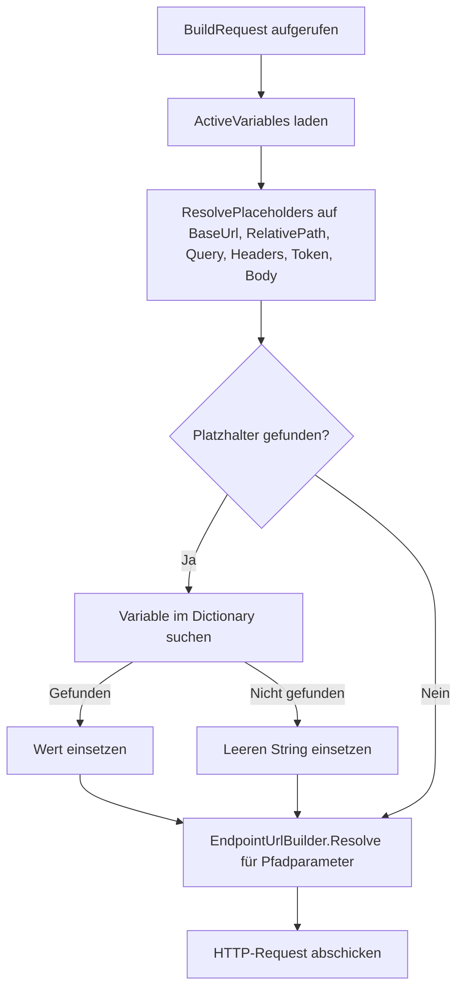

# Systemumgebungen — Technischer Ablauf

## Übersicht

Das Feature besteht aus drei Bereichen: Datenhaltung und Repository-Zugriff, Zustandsverwaltung pro Blazor-Circuit, sowie Platzhalterauflösung beim Ausführen von Endpunkten. Die UI-Komponenten `EnvironmentSelector`, `EnvironmentManagementOverlay` und `EnvironmentEditor` arbeiten mit `ISystemEnvironmentRepository` und `IActiveEnvironmentService` zusammen. `MainLayout` koordiniert den Lebenszyklus und die SignalR-Integration.

---

## Ablauf: Seite laden — aktive Umgebung wiederherstellen

### 1. Erste Initialisierung in `MainLayout`

`MainLayout.OnAfterRenderAsync(firstRender: true)` wird aufgerufen. Neben der Theme-Initialisierung und dem SignalR-Verbindungsaufbau wird `RestoreEnvironmentFromLocalStorageAsync(StorageModeService.CurrentMode)` aufgerufen.

Beteiligte Komponenten:
- `MainLayout.OnAfterRenderAsync` — Einstiegspunkt beim ersten Render

### 2. `localStorage`-Wert lesen

`RestoreEnvironmentFromLocalStorageAsync` liest via `IJSRuntime.InvokeAsync` den `localStorage`-Eintrag mit dem Schlüssel `LocalStorageKeys.SelectedEnvironmentId(mode)` (z. B. `selectedEnvironmentId_Team`).

Beteiligte Komponenten:
- `LocalStorageKeys.SelectedEnvironmentId(StorageMode)` — erzeugt den Schlüssel
- `IJSRuntime` — JavaScript-Interop

### 3. Umgebung laden und aktivieren

Ist eine ID gespeichert, ruft `RestoreEnvironmentFromLocalStorageAsync` `ISystemEnvironmentRepository.GetByIdAsync(id)` auf. Existiert die Umgebung noch, wird `IActiveEnvironmentService.SetActiveEnvironment(environment)` aufgerufen. Existiert sie nicht mehr, wird `SetActiveEnvironment(null)` gesetzt und der `localStorage`-Eintrag entfernt.

Beteiligte Komponenten:
- `SystemEnvironmentRepository.GetByIdAsync` — Datenbankabfrage inkl. `Variables`
- `ActiveEnvironmentService.SetActiveEnvironment` — setzt `ActiveEnvironment` und materialisiert `ActiveVariables`

---

## Ablauf: Umgebung anlegen

### 1. Overlay öffnen

Klick auf das Zahnrad-Icon in `MainLayout` ruft `OpenEnvironmentManagementAsync()` auf, das `EnvironmentManagementOverlay.OpenAsync()` aufruft.

### 2. Umgebungsliste laden

`EnvironmentManagementOverlay.LoadEnvironmentsAsync()` ruft `ISystemEnvironmentRepository.GetEnvironmentsAsync(mode, owner)` auf. Das Repository filtert über `ApplyOwnerFilter`: Im Benutzermodus (`StorageMode.User`) werden nur Umgebungen des aktuellen Benutzers zurückgegeben; im Team-Modus alle.

Beteiligte Komponenten:
- `SystemEnvironmentRepository.GetEnvironmentsAsync` — gibt Umgebungen sortiert nach `Name` zurück
- `SystemEnvironmentRepository.ApplyOwnerFilter` — interne Filtermethode

### 3. Editor öffnen und Eingabe validieren

Klick auf „Neu" setzt `_isCreating = true`; `EnvironmentEditor` wird ohne Vorbelegung gerendert. `EnvironmentEditor.SaveAsync()` prüft vor dem Speichern:

- `Name` darf nicht leer sein und maximal 200 Zeichen haben.
- Variablennamen dürfen nicht leer sein, nicht länger als 200 Zeichen und nicht doppelt vorkommen.
- Variablenwerte dürfen maximal 4000 Zeichen haben.
- Eindeutigkeit des Namens pro Modus: `GetEnvironmentsAsync` wird aufgerufen; ein Treffer mit abweichender ID führt zur Fehlermeldung „Eine Umgebung mit diesem Namen existiert bereits."

Beteiligte Komponenten:
- `EnvironmentEditor.SaveAsync` — Validierung und Speicherung
- `ISystemEnvironmentRepository.GetEnvironmentsAsync` — UI-seitige Eindeutigkeitsprüfung

### 4. Persistieren und Benachrichtigung

`ISystemEnvironmentRepository.AddAsync(systemEnvironment)` wird aufgerufen. `AddAsync` setzt bei `StorageMode.User` den `Owner` via `ICurrentUserService.GetCurrentUserName()`. Im Team-Modus löst `EnvironmentManagementOverlay.OnEnvironmentSaved` `ISignalRNotificationService.NotifyEnvironmentChangedAsync()` aus.

Beteiligte Komponenten:
- `SystemEnvironmentRepository.AddAsync` — Datenbankpersistierung
- `ICurrentUserService.GetCurrentUserName` — setzt `Owner` im Benutzermodus
- `SignalRNotificationService.NotifyEnvironmentChangedAsync` — sendet `EnvironmentChanged` an Gruppe `environments`

### 5. Liste aktualisieren

`EnvironmentManagementOverlay` lädt die Liste neu; `OnEnvironmentsChanged.InvokeAsync()` benachrichtigt `MainLayout`, das `EnvironmentSelector.RefreshAsync()` aufruft.

---

## Ablauf: Umgebung bearbeiten

Entspricht dem Anlegen, jedoch wird `EnvironmentEditor` mit `ExistingEnvironment` vorbelegt. `SaveAsync` ruft `ISystemEnvironmentRepository.UpdateAsync(systemEnvironment)` auf. `UpdateAsync` synchronisiert Variablen des `existing`-Objekts im Datenbankkontext: neue Variablen (`Id == 0`) werden hinzugefügt, entfernte gelöscht, bestehende aktualisiert.

Beteiligte Komponenten:
- `SystemEnvironmentRepository.UpdateAsync` — differenzielle Variablen-Synchronisation

---

## Ablauf: Umgebung löschen

`EnvironmentManagementOverlay.ConfirmDeleteAsync()` ruft `ISystemEnvironmentRepository.DeleteAsync(id)` auf. Das Cascade Delete in der Datenbank entfernt automatisch alle zugehörigen `EnvironmentVariable`-Einträge. Im Team-Modus wird `NotifyEnvironmentChangedAsync` aufgerufen.

---

## Ablauf: Aktive Umgebung wählen (Dropdown)

`EnvironmentSelector.OnSelectionChanged` wird aufgerufen. Bei einer gültigen ID wird der `localStorage`-Eintrag geschrieben und `IActiveEnvironmentService.SetActiveEnvironment(environment)` aufgerufen. Bei leerer Auswahl wird der Eintrag entfernt und `SetActiveEnvironment(null)` gesetzt.

`ActiveEnvironmentService.SetActiveEnvironment` materialisiert `ActiveVariables` als `Dictionary<string, string>` aus den Variablen der Umgebung und löst `OnActiveEnvironmentChanged` aus.

---

## Ablauf: Moduswechsel

`MainLayout.OnStorageModeChanged` setzt den neuen Modus via `StorageModeService.SetMode(mode)` und ruft anschließend `RestoreEnvironmentFromLocalStorageAsync(mode)` auf (siehe „Seite laden"). `EnvironmentSelector.RefreshAsync()` wird separat aufgerufen, um die Auswahlbox mit den Umgebungen des neuen Modus zu befüllen.

---

## Ablauf: SignalR-Aktualisierung im Team-Modus

`MainLayout` abonniert beim Start das `EnvironmentChanged`-Ereignis über eine `HubConnection` (URL `/hubs/endpoint`, Methode `SubscribeToEnvironments`). Bei Eingang des Events wird `OnEnvironmentChanged()` aufgerufen:

1. Falls eine Umgebung aktiv ist: `GetByIdAsync(activeId)` prüft, ob sie noch existiert.
2. Nicht mehr vorhanden: `SetActiveEnvironment(null)`, `localStorage`-Eintrag entfernen.
3. Noch vorhanden: `SetActiveEnvironment(updated)` mit aktualisierter Umgebung.
4. `EnvironmentSelector.RefreshAsync()` wird aufgerufen.

Beteiligte Komponenten:
- `EndpointHub.SubscribeToEnvironments` / `UnsubscribeFromEnvironments` — Gruppen-Management
- `SignalRNotificationService.NotifyEnvironmentChangedAsync` — sendet an Gruppe `environments`

---

## Ablauf: Platzhalterauflösung beim Ausführen eines Endpunkts

`EndpointExecutionService.BuildRequest` ruft `_activeEnvironmentService.ActiveVariables` ab (kein Datenbankzugriff). Die privaten Aufrufe von `ResolvePlaceholders(input, variables)` ersetzen via `DoubleBracePlaceholderRegex` (`\{\{([^}]+)\}\}`) alle `{{name}}`-Vorkommen:

1. Basis-URL (`Application.BaseUrl`)
2. Relativer Pfad (`Endpoint.RelativePath`)
3. Query-Parameter-Schlüssel und -Werte (`Endpoint.QueryParameters`)
4. Header-Schlüssel und -Werte (`Endpoint.Headers`)
5. Bearer-Token (aus `ICredentialService.GetPassword`)
6. Body (`Endpoint.Body`)

Erst danach greift `EndpointUrlBuilder.Resolve` für die `{pfadparameter}`-Auflösung.

Beteiligte Komponenten:
- `EndpointExecutionService.ResolvePlaceholders` — statische Methode mit Regex-Ersetzung
- `ActiveEnvironmentService.ActiveVariables` — materialisiertes Dictionary
- `EndpointUrlBuilder.Resolve` — nachgelagerte Pfadparameter-Auflösung

## Diagramm

## Fehlerbehandlung

- Fehler beim `localStorage`-Zugriff (z. B. Server-Prerendering): werden mit `try/catch` abgefangen und stillschweigend ignoriert; die aktive Umgebung wird auf `null` gesetzt.
- Fehler beim Löschen oder Speichern in `EnvironmentManagementOverlay`: werden als Fehlermeldung in `_deleteError` bzw. `_errorMessage` im Editor angezeigt.
- Fehler beim Aufbau der SignalR-Verbindung in `MainLayout`: werden als `LogDebug` geloggt; die Anwendung läuft ohne Live-Updates weiter.
