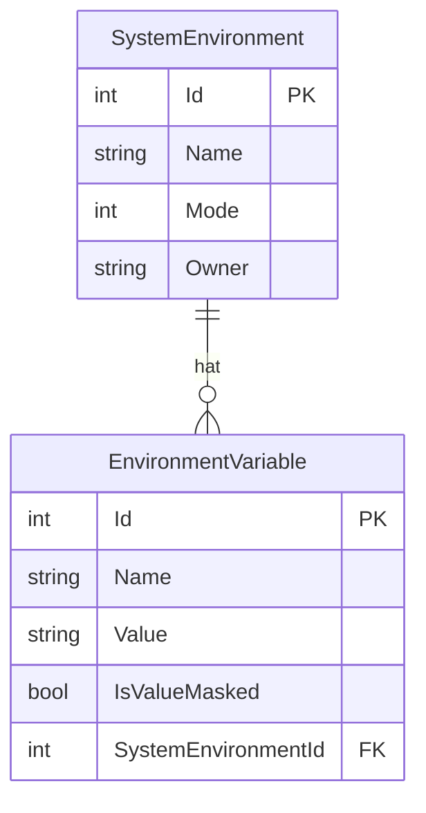

# Systemumgebungen — Datenmodell

## Entitäten

### `SystemEnvironment`

| Eigenschaft | Typ | Beschreibung |
|-------------|-----|--------------|
| `Id` | `int` | Primärschlüssel |
| `Name` | `string` (max. 200) | Name der Umgebung; eindeutig pro `Mode` + `Owner` |
| `Mode` | `StorageMode` | Zuordnung zu Team- oder Benutzermodus |
| `Owner` | `string?` (max. 256) | Windows-Benutzername bei `StorageMode.User`; `null` im Teammodus |
| `Variables` | `ICollection<EnvironmentVariable>` | Navigationseigenschaft zur Variablenliste |

### `EnvironmentVariable`

| Eigenschaft | Typ | Beschreibung |
|-------------|-----|--------------|
| `Id` | `int` | Primärschlüssel |
| `Name` | `string` (max. 200) | Variablenname; eindeutig pro `SystemEnvironmentId` |
| `Value` | `string` (max. 4000) | Variablenwert |
| `IsValueMasked` | `bool` | Steuert die Darstellung in der UI: `true` = Passwortfeld |
| `SystemEnvironmentId` | `int` | Fremdschlüssel auf `SystemEnvironment` |
| `SystemEnvironment` | `SystemEnvironment?` | Navigationseigenschaft |

## Beziehungen

Eine `SystemEnvironment` enthält beliebig viele `EnvironmentVariable`-Einträge (1:n). Wird eine `SystemEnvironment` gelöscht, werden alle zugehörigen `EnvironmentVariable`-Einträge automatisch mitgelöscht (Cascade Delete).

## Constraints

- Unique-Constraint auf `SystemEnvironment`: (`Name`, `Mode`, `Owner`) — verhindert doppelte Umgebungsnamen pro Modus und Benutzer.
- Unique-Constraint auf `EnvironmentVariable`: (`Name`, `SystemEnvironmentId`) — verhindert doppelte Variablennamen innerhalb einer Umgebung.

## Diagramm

## Datenbankmigrationen

| Migrationsname | Beschreibung |
|----------------|-------------|
| `AddSystemEnvironments` | Legt die Tabellen `SystemEnvironments` und `EnvironmentVariables` mit allen Constraints und dem Cascade-Delete-Fremdschlüssel an |
