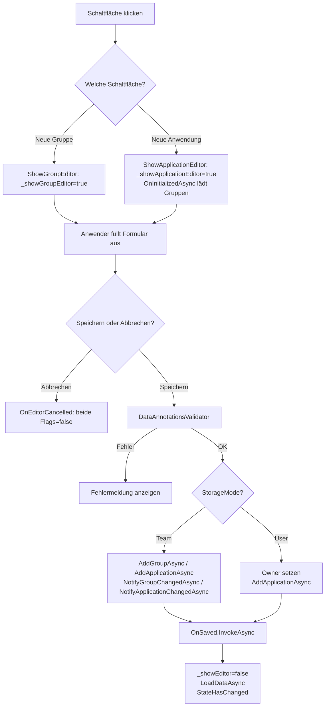

# Verwaltung der Anwendungen — Technischer Ablauf

## Übersicht

Der Nutzer löst über Schaltflächen in `ApplicationGroupTree` die Anzeige eines der beiden Editoren aus. Der Editor nimmt Eingaben entgegen, persistiert den neuen Datensatz über `IApplicationRepository` und ruft den `OnSaved`-Callback auf. `ApplicationGroupTree` reagiert darauf, indem es die Datenliste neu lädt und den Editor ausblendet.

## Ablauf

### 1. Formular einblenden

Der Anwender klickt auf „Neue Gruppe" oder „Neue Anwendung" in `ApplicationGroupTree`.

Beteiligte Komponenten:
- `ApplicationGroupTree.ShowGroupEditor` — Setzt `_showGroupEditor = true`, `_showApplicationEditor = false`
- `ApplicationGroupTree.ShowApplicationEditor` — Setzt `_showApplicationEditor = true`, `_showGroupEditor = false`

Die bedingte Darstellung in der Razor-Vorlage blendet dann `ApplicationGroupEditor` bzw. `ApplicationEditor` ein.

### 2. Initialisierung des `ApplicationEditor`

Beim Einblenden des `ApplicationEditor` wird `OnInitializedAsync` aufgerufen.

Beteiligte Komponenten:
- `ApplicationEditor.OnInitializedAsync` — Ruft `IApplicationRepository.GetGroupsAsync` mit dem aktuellen `StorageMode` und dem Benutzernamen aus `ICurrentUserService.GetCurrentUserName()` auf; befüllt `_groups` für das Gruppen-`<select>`-Element.

Der `ApplicationGroupEditor` hat keine Initialisierungslogik.

### 3. Formulareingabe und Validierung

Der Anwender füllt die Felder aus und klickt auf **Speichern**. Das `EditForm` führt eine `DataAnnotationsValidator`-Prüfung durch. Bei Validierungsfehlern wird die Fehlermeldung neben dem Feld angezeigt; `SaveAsync` wird nur bei erfolgreicher Validierung aufgerufen (`OnValidSubmit`).

### 4. Persistierung — Gruppe anlegen

Beteiligte Komponenten:
- `ApplicationGroupEditor.SaveAsync` — Ruft `IApplicationRepository.AddGroupAsync(_model)` auf.
- Bei `StorageMode.Team`: Ruft `ISignalRNotificationService.NotifyGroupChangedAsync(saved.Id)` auf.
- Nach Erfolg: Setzt `_model = new ApplicationGroup()`, ruft `OnSaved.InvokeAsync()` auf.
- Bei Exception: Setzt `_errorMessage` und zeigt einen Fehlerhinweis an.

### 5. Persistierung — Anwendung anlegen

Beteiligte Komponenten:
- `ApplicationEditor.SaveAsync` — Befüllt bei `StorageMode.User` die Eigenschaft `_model.Owner` mit `ICurrentUserService.GetCurrentUserName()`.
- Ruft `IApplicationRepository.AddApplicationAsync(_model)` auf.
- Bei `StorageMode.Team`: Ruft `ISignalRNotificationService.NotifyApplicationChangedAsync(saved.Id)` auf.
- Nach Erfolg: Setzt `_model = new Application()`, ruft `OnSaved.InvokeAsync()` auf.
- Bei Exception: Setzt `_errorMessage` und zeigt einen Fehlerhinweis an.

### 6. Callback und Datenliste aktualisieren

Beteiligte Komponenten:
- `ApplicationGroupTree.OnGroupSaved` / `ApplicationGroupTree.OnApplicationSaved` — Setzt das jeweilige Sichtbarkeits-Flag auf `false`, ruft `LoadDataAsync()` auf und anschließend `StateHasChanged()`.
- `ApplicationGroupTree.LoadDataAsync` — Lädt `_groups` via `IApplicationRepository.GetGroupsAsync` und `_ungroupedApplications` via `IApplicationRepository.GetUngroupedApplicationsAsync` neu.

### 7. Abbrechen

Beteiligte Komponenten:
- `ApplicationGroupEditor.Cancel` / `ApplicationEditor.Cancel` — Ruft `OnCancel.InvokeAsync()` auf.
- `ApplicationGroupTree.OnEditorCancelled` — Setzt `_showGroupEditor = false` und `_showApplicationEditor = false`.

## Diagramm

## Fehlerbehandlung

Beide Editoren fangen Ausnahmen in `SaveAsync` ab und setzen `_errorMessage`. Die Fehlermeldung wird als `alert alert-danger` unterhalb der Formularfelder angezeigt. Das Formular bleibt geöffnet, sodass der Anwender die Eingaben korrigieren kann.
