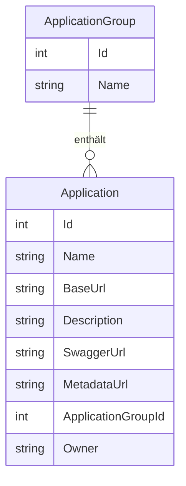

# Verwaltung der Anwendungen — Datenmodell

## Entitäten

Die Entitäten `ApplicationGroup` und `Application` sind in `Schnittstellenzentrale.Core` definiert und waren bereits vor dieser Funktion vorhanden. Durch diese Funktion werden sie erstmals über die Benutzeroberfläche befüllt.

### `ApplicationGroup`

| Eigenschaft | Typ | Beschreibung |
|-------------|-----|--------------|
| `Id` | `int` | Primärschlüssel (automatisch vergeben) |
| `Name` | `string` | Anzeigename der Gruppe (Pflichtfeld) |
| `Applications` | `IList<Application>` | Zugeordnete Anwendungen (Navigationseigenschaft) |

### `Application`

| Eigenschaft | Typ | Beschreibung |
|-------------|-----|--------------|
| `Id` | `int` | Primärschlüssel (automatisch vergeben) |
| `Name` | `string` | Anzeigename der Anwendung (Pflichtfeld) |
| `BaseUrl` | `string` | Basis-URL des Dienstes (Pflichtfeld) |
| `Description` | `string?` | Optionale Beschreibung |
| `SwaggerUrl` | `string?` | Optionale URL zur Swagger/OpenAPI-Beschreibung |
| `MetadataUrl` | `string?` | Optionale URL zu weiteren Metadaten |
| `ApplicationGroupId` | `int?` | Fremdschlüssel zur zugeordneten Gruppe (optional) |
| `Owner` | `string?` | Windows-Benutzername des Eigentümers; nur im Benutzermodus gesetzt |

## Beziehungen

Eine `ApplicationGroup` kann keine oder beliebig viele `Application`-Einträge enthalten. Die Zuordnung ist optional: Eine `Application` kann auch ohne Gruppe (`ApplicationGroupId = null`) angelegt werden.

## Diagramm

